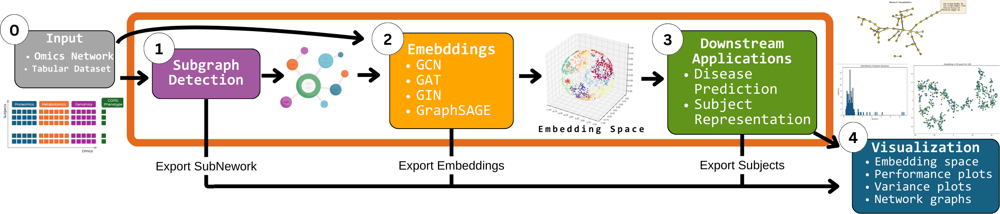

# BioNeuralNet: A Multi-Omics Integration and GNN-Based Embedding Framework


## Overview

**BioNeuralNet** is a Python-based framework for **multi-omics integration** that uses
**Graph Neural Networks (GNNs)** to transform high-dimensional omics networks into
compact **embeddings**. Researchers can leverage these embeddings for **clustering**,
**subject representation**, and **disease prediction**. See below for a high-level diagram
of BioNeuralNet’s workflow:



## Key Features

BioNeuralNet offers five core steps in a typical workflow:

1. **Graph Construction**:
   - **Not** performed internally. You provide or build adjacency matrices externally
     (e.g., via WGCNA, SmCCNet, or your own scripts).
   - We provide lightweight wrappers in `bioneuralnet.external_tools` (WGCNA, SmCCNet)
     if you wish, but these are **not** mandatory for BioNeuralNet’s pipeline.

2. **Graph Clustering**:
   - Identify functional modules/communities using , **PageRank**.
   - Our `PageRank` can be used to find subnetwork clusters via personalized
     sweep cuts, capturing local neighborhoods influenced by seed nodes.

3. **Network Embedding**:
   - Generate embeddings with **GCN**, **GAT**, **GraphSAGE**, **GIN**.
   - You can attach a numeric label to each node or remain “unsupervised,” relying
     only on graph structure and node features (e.g. correlation with clinical data).

4. **Subject Representation**:
   - Integrate node embeddings back into omics data, enriching each subject’s feature
     vector by weighting columns with the learned embedding scalars.

5. **Downstream Tasks**:
   - Perform advanced analyses such as disease prediction via **DPMON**, which trains a GNN
     end-to-end with a classifier to incorporate local/global network information.

---

## Installation

### 1. Basic Install

1. **Install PyTorch and Pytorch Geometric**:
   - Follow the [PyTorch official instructions](https://pytorch.org/get-started/locally/) to
     pick the correct CPU/GPU version for your OS and CUDA drivers.

   - [PyTorch Geometric official instructions](https://pytorch-geometric.readthedocs.io/en/latest/notes/installation.html)

   - Example (CPU-only):
     ```bash
     pip install torch torchvision torchaudio
     pip install torch_geometric
     ```
   - Or a GPU-accelerated version if you have CUDA.

2. **Install BioNeuralNet**:
   ```bash
   pip install bioneuralnet==0.1.0b1
   ```

You now have the main Python modules (e.g., `GNNEmbedding`, `DPMON`, etc.) ready to go.

### 2. (Optional) R & Additional Tools

- **R Installation**:
  - If you want to generate adjacency matrices via WGCNA or SmCCNet, install R from
    [r-project.org](https://www.r-project.org/).
  - In R, install packages:
    ```r
    install.packages("WGCNA")
    ```
- **Other External Tools** in `bioneuralnet.external_tools`:
  - **`Node2Vec`**: Node2Vec-based embeddings
  - **`FeatureSelector`**: Basic feature selection strategies (e.g., LassoCV, random forest)
  - **`HierarchicalClustering`**: Agglomerative clustering, silhouette scoring
  - **`StaticVisualizer`, `DynamicVisualizer`**: Basic static or interactive network visualization
  - **`SmCCNet` / `WGCNA`**: Build adjacency matrices using R-based libraries
- These integrations are purely **optional** and do **not** form part of the core pipeline.

### 3. Development Setup (Optional)

If you plan to contribute:

```bash
git clone https://github.com/UCD-BDLab/BioNeuralNet.git
cd BioNeuralNet
pip install -r requirements-dev.txt
pytest
```

---

## Quick Example

Below is a **minimal** snippet that shows how to load an already-built adjacency matrix,
generate embeddings via **GNNEmbedding**, and then run **DPMON** for disease prediction:

```python
import pandas as pd
from bioneuralnet.network_embedding import GNNEmbedding
from bioneuralnet.downstream_task import DPMON

omics_data = pd.read_csv("omics_data.csv", index_col=0)
adjacency_matrix = pd.read_csv("adjacency_matrix.csv", index_col=0)
clinical_data = pd.read_csv("clinical_data.csv", index_col=0)
phenotype_data = pd.read_csv("phenotype_data.csv", index_col=0)

gnn_embed = GNNEmbedding(
    adjacency_matrix=adjacency_matrix,
    omics_data=omics_data,
    phenotype_data=phenotype_data,
    clinical_data=clinical_data,
    model_type='GAT',
    hidden_dim=64
)
embed_out = gnn_embed.run()
node_embeds = embed_out["graph"]
print("Node Embeddings shape:", node_embeds.shape)

dpmon = DPMON(
    adjacency_matrix=adjacency_matrix,
    omics_list=[omics_data],
    phenotype_data=phenotype_data,
    clinical_data=clinical_data,
    model='GAT',
    epoch_num=5
)
predictions = dpmon.run()
print("Predictions:\n", predictions.head())
```

**Result**:
- **Node Embeddings**: `(num_nodes, embedding_dim)`
- **Disease Phenotype Predictions**: DataFrame linking each subject to predicted classes

---

## Documentation & Tutorials

- Extensive documentation at [Read the Docs](https://bioneuralnet.readthedocs.io/en/latest/index.html)
- Tutorials illustrating:
  - Unsupervised vs. label-based GNN usage
  - PageRank clustering and hierarchical clustering
  - Subject representation
  - Integrating external tools like WGCNA, SmCCNet

## Frequently Asked Questions (FAQ)

Key topics include:
- **GPU acceleration** vs. CPU-only
- **External Tools** usage (R-based adjacency construction, Node2Vec, etc.)
- **DPMON** for local/global structure-based disease prediction
- **PageRank or HierarchicalClustering** for subnetwork identification

See [FAQ](https://bioneuralnet.readthedocs.io/en/latest/faq.html) for more.

---

## Acknowledgments

BioNeuralNet relies on or interfaces with various open-source libraries:

- [PyTorch](https://pytorch.org/) / [PyTorch Geometric](https://github.com/pyg-team/pytorch_geometric)
- [Node2Vec](https://github.com/aditya-grover/node2vec)
- [WGCNA](https://cran.r-project.org/package=WGCNA) / [SmCCNet](https://cran.r-project.org/package=SmCCNet)
- [Pytest](https://pytest.org/), [Sphinx](https://www.sphinx-doc.org), [Black](https://black.readthedocs.io/), [Flake8](https://flake8.pycqa.org/)

We appreciate the efforts of these communities and all contributors.

## Testing & CI

1. **Local Testing**:
   ```bash
   pytest --cov=bioneuralnet --cov-report=html
   open htmlcov/index.html
   ```

2. **Continuous Integration**:
   - GitHub Actions run our test suite and code checks on each commit and PR.

## Contributing

- **Fork** the repository, create a new branch, implement your changes.
- **Add/Update** tests, docstrings, and examples if appropriate.
- **Open** a pull request describing your modifications.

For more details, see our [FAQ](https://bioneuralnet.readthedocs.io/en/latest/faq.html)
or open an [issue](https://github.com/UCD-BDLab/BioNeuralNet/issues).

## License & Contact

- **License**: [MIT License](https://github.com/UCD-BDLab/BioNeuralNet/blob/main/LICENSE)
- **Contact**: Questions or feature requests? [Open an issue](https://github.com/UCD-BDLab/BioNeuralNet) or email [vicente.ramos@ucdenver.edu](mailto:vicente.ramos@ucdenver.edu).

---

BioNeuralNet aims to **streamline** multi-omics network analysis by providing **graph clustering**, **GNN embedding**, **subject representation**, and **disease prediction** tools. We hope it helps uncover new insights in multi-omics research.
