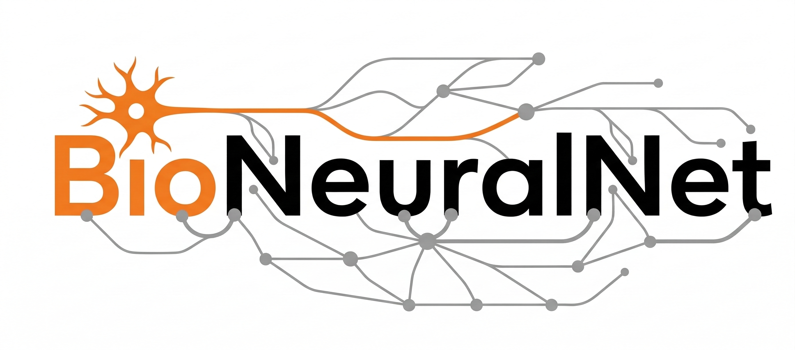
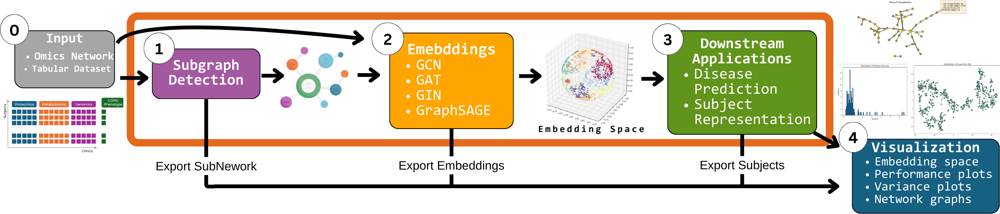
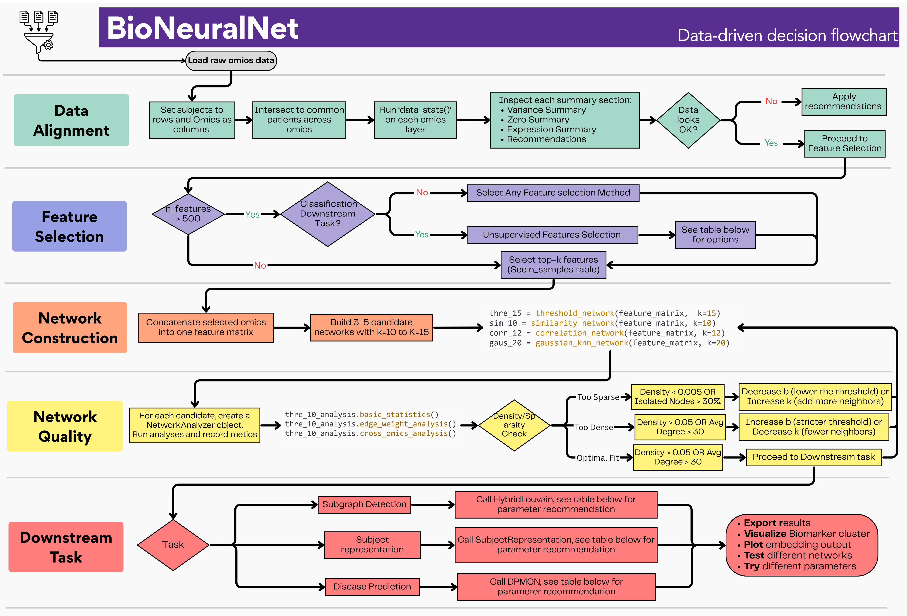

# BioNeuralNet: A Graph Neural Network based Multi-Omics Network Data Analysis Tool

[](https://creativecommons.org/licenses/by-nc-nd/4.0/)
[](https://pypi.org/project/bioneuralnet/)
[](https://github.com/UCD-BDLab/BioNeuralNet/issues)
[](https://github.com/UCD-BDLab/BioNeuralNet/graphs/contributors)
[](https://pepy.tech/project/bioneuralnet)
[](https://bioneuralnet.readthedocs.io/en/latest/)
[](https://doi.org/10.5281/zenodo.17503083)

## Welcome to BioNeuralNet 1.3.1



**BioNeuralNet** is a flexible and modular Python framework tailored for **end-to-end network-based multi-omics data analysis**. It leverages **Graph Neural Networks (GNNs)** to learn biologically meaningful low-dimensional representations from multi-omics networks, converting complex molecular interactions into versatile embeddings suitable for downstream tasks.




## Citation

If you use BioNeuralNet in your research, we kindly ask that you cite our paper:

> Ramos, V., Hussein, S., et al. (2025).
> [**BioNeuralNet: A Graph Neural Network based Multi-Omics Network Data Analysis Tool**](https://arxiv.org/abs/2507.20440).
> *arXiv preprint arXiv:2507.20440* | [**DOI: 10.48550/arXiv.2507.20440**](https://doi.org/10.48550/arXiv.2507.20440).


For your convenience, you can use the following BibTeX entry:

<details>
  <summary>BibTeX Citation</summary>

```bibtex
@misc{ramos2025bioneuralnetgraphneuralnetwork,
      title={BioNeuralNet: A Graph Neural Network based Multi-Omics Network Data Analysis Tool},
      author={Vicente Ramos and Sundous Hussein and Mohamed Abdel-Hafiz and Arunangshu Sarkar and Weixuan Liu and Katerina J. Kechris and Russell P. Bowler and Leslie Lange and Farnoush Banaei-Kashani},
      year={2025},
      eprint={2507.20440},
      archivePrefix={arXiv},
      primaryClass={cs.LG},
      url={https://arxiv.org/abs/2507.20440},
}
```
</details>

## Documentation

For complete documentation, tutorials, and examples, please visit our Read the Docs site:
**[bioneuralnet.readthedocs.io](https://bioneuralnet.readthedocs.io/en/latest/)**

## Table of Contents

- [1. Installation](#1-installation)
  - [1.1. Install BioNeuralNet](#11-install-bioneuralnet)
  - [1.2. Install PyTorch and PyTorch Geometric](#12-install-pytorch-and-pytorch-geometric)
- [2. BioNeuralNet Core Features](#2-bioneuralnet-core-features)
- [3. Why Graph Neural Networks for Multi-Omics?](#3-Why-Graph-Neural-Networks-for-Multi-Omics)
- [4. Example: Network-Based Multi-Omics Analysis for Disease Prediction](#4-Network-Based-Multi-Omics-Analysis-for-Disease-Prediction)
- [5. Explore BioNeuralNet's Documentation](#6-Explore-BioNeuralNet-Documentation)
- [6. Acknowledgments](#7-Acknowledgments)
- [7. Contributing](#8-Contributing)
- [8. License](#9-License)
- [9. Contact](#10-Contact)
- [10. References](#11-References)
- [11. Citation](#11-Citation)

## 1. Installation

BioNeuralNet is available as a package on the Python Package Index (PyPI), making it easy to install and integrate into your workflows. BioNeuralNet is tested with Python `3.10`, `3.11`, and `3.12` and supports Linux, macOS, and Windows.

For detailed, up-to-date system requirements (including recommended CPU/GPU configurations, CUDA/PyG compatibility tables, and troubleshooting), see the **Installation Guide** in the documentation:
**[https://bioneuralnet.readthedocs.io/en/latest/installation.html](https://bioneuralnet.readthedocs.io/en/latest/installation.html)**

### 1.1. Install BioNeuralNet

Install the core BioNeuralNet package (including graph embeddings, DPMON, and clustering):

```bash
pip install bioneuralnet
```

**PyPI Project Page:** [https://pypi.org/project/bioneuralnet/](https://pypi.org/project/bioneuralnet/)

> **Requirements:** BioNeuralNet is tested and supported on Python versions `3.10`, `3.11`, `3.12` and `3.13`. Functionality on other versions is not guaranteed.

A typical environment includes:

  - Linux, macOS, or Windows
  - At least 8 GB RAM (16 GB+ recommended for moderate datasets)
  - Optional GPU (e.g., NVIDIA with ≥ 6 GB VRAM or Apple Silicon using Metal/MPS) for faster GNN and DPMON training

For advanced setups (multi-GPU, clusters, external R tools like SmCCNet), please refer to the [installation documentation](https://bioneuralnet.readthedocs.io/en/latest/installation.html).

### 1.2. Install PyTorch and PyTorch Geometric

BioNeuralNet relies on PyTorch and PyTorch Geometric for GNN computations (embeddings and DPMON). These are **not automatically pinned** because CPU/GPU builds and CUDA versions vary by system, so you should install them separately.

  - **Basic installation (CPU-only or simple environments):**

    ```bash
    pip install torch
    pip install torch_geometric
    ```

For GPU acceleration and environment-specific wheels:

  - [PyTorch Installation Guide](https://pytorch.org/get-started/locally/)
  - [PyTorch Geometric Installation Guide](https://pytorch-geometric.readthedocs.io/en/latest/notes/installation.html)

On Apple Silicon (M1/M2/M3), PyTorch can use the **Metal (MPS)** backend instead of CUDA (see the official PyTorch/Apple guides).

For example tested configurations, CUDA/PyG compatibility matrices, Ray installation for hyperparameter tuning, and troubleshooting steps, see the **Installation** section of the documentation:
**[https://bioneuralnet.readthedocs.io/en/latest/installation.html](https://bioneuralnet.readthedocs.io/en/latest/installation.html)**

## 2. BioNeuralNet Core Features

BioNeuralNet is a flexible and modular Python framework tailored for **end-to-end network-based multi-omics data analysis**. It leverages **Graph Neural Networks (GNNs)** to learn biologically meaningful low-dimensional representations from multi-omics networks, converting complex molecular interactions into versatile embeddings suitable for downstream tasks.

**BioNeuralNet Provides:**

  - **[Network Construction](https://bioneuralnet.readthedocs.io/en/latest/network.html):**

      - **Similarity graphs:** k-NN (cosine/Euclidean), RBF, mutual information.
      - **Correlation graphs:** Pearson, Spearman; optional soft-thresholding.
      - **Phenotype-aware graphs:** SmCCNet integration (R) for sparse multiple canonical-correlation networks.
      - **Gaussian kNN graphs:** kNN-based graphs with Gaussian kernel weighting.

    **Example: constructing multiple network types and running basic graph analysis**

    ```python
    import pandas as pd
    from bioneuralnet.network import (
        threshold_network,
        correlation_network,
        similarity_network,
        gaussian_knn_network,
        NetworkAnalyzer,
    )

    # dna_meth, rna, and mirna are preprocessed omics DataFrames with matching samples
    omics_brca = pd.concat([dna_meth, rna, mirna], axis=1)

    # Threshold-based graph
    threshold_10 = threshold_network(omics_brca, b=6.2, k=10)

    # Correlation graph (unsigned Pearson)
    correlation_10 = correlation_network(omics_brca, k=10, method="pearson", signed=False)

    # Similarity graph (cosine-based kNN)
    similarity_10 = similarity_network(omics_brca, k=10, metric="cosine")

    # Gaussian kNN graph
    gaussian_15 = gaussian_knn_network(omics_brca, k=15, sigma=None)

    # Network-level topology assessment
    analyzer = NetworkAnalyzer(threshold_10)
    analyzer.basic_statistics(threshold=0.1)
    analyzer.edge_weight_analysis()
    ```

  - **[Preprocessing Utilities](https://bioneuralnet.readthedocs.io/en/latest/utils.html#preprocessing-utilities):**

      - **RData conversion to pandas DataFrame:** Converts an RData file to CSV and loads it into a pandas DataFrame.
      - **Top-k variance-based filtering:** Cleans data and selects the top-k numeric features by variance.
      - **Random forest feature selection:** Fits a RandomForest and returns the top-k features by importance.
      - **ANOVA F-test feature selection:** Runs an ANOVA F-test with FDR correction and selects significant features.
      - **Network pruning by edge-weight threshold:** Removes edges below a weight threshold and drops isolated nodes.
      - **Missing data handling:** Utilities such as `impute_simple` and `impute_knn` for incomplete multi-omics matrices.

  - **[GNN Embeddings](https://bioneuralnet.readthedocs.io/en/latest/gnns.html):**

      - Transform complex biological networks into versatile embeddings, capturing both structural relationships and molecular interactions.

  - **[Downstream Tasks](https://bioneuralnet.readthedocs.io/en/latest/downstream_tasks.html):**

      - **[Subject representation](https://bioneuralnet.readthedocs.io/en/latest/downstream_tasks.html#enhanced-subject-representation):** Integrate phenotype or clinical variables to enhance the biological relevance of the embeddings.
      - **[Disease Prediction](https://bioneuralnet.readthedocs.io/en/latest/downstream_tasks.html#enhanced-subject-representation):** Utilize network-derived embeddings for accurate and scalable predictive modeling of diseases and phenotypes (e.g., via DPMON).

  - **Interoperability:**

      - Outputs structured as **Pandas DataFrames**, ensuring compatibility with common Python tools and seamless integration into existing bioinformatics pipelines.

**Visualizing Multi-Omics Networks**

BioNeuralNet allows you to inspect the topology of your constructed networks. The visualization below, from our **TCGA Lower Grade Glioma (LGG)** analysis, highlights a survival-associated module of highly correlated omics features identified by HybridLouvain.


*Network visualization of a survival-associated gene module identified in the TCGA-LGG dataset.*

**Top Identified Biomarkers (Hub Omics)**

The top hub features (by degree centrality) in the network above include:

| Feature Name (Omic) | Index | Degree | Source |
| :--- | :---: | :---: | :---: |
| HIVEP3 | 20 | 7 | RNA |
| DBH | 19 | 7 | RNA |
| ERMP1 | 8 | 7 | RNA |
| LFNG | 12 | 6 | RNA |
| MIR23A | 21 | 6 | miRNA |
| THADA | 4 | 6 | RNA |

**Network Embeddings**

By projecting high-dimensional omics networks into latent spaces, BioNeuralNet distills complex, nonlinear molecular relationships into compact vectorized representations. The t-SNE projection below reveals distinct clusters corresponding to different omics modalities (e.g., DNA methylation, RNA, miRNA).


*2D projection of network embeddings showing distinct separation between omics modalities.*

**Key Considerations for Robust Analysis**

  - **Network topology sensitivity:** Performance is inherently tied to the quality of the constructed network. Compare multiple strategies (e.g., correlation vs similarity vs Gaussian kNN).
  - **Feature selection impact:** Results depend heavily on input features. Different preselection strategies (Top-k variance, ANOVA-F, Random Forest) can reveal complementary biology.
  - **Handling missing data:** Incomplete multi-omics data are common; use built-in imputation utilities where appropriate.
  - **Computational scalability:** Extremely large networks may require more aggressive feature reduction or subgraph detection to stay efficient.
  - **Interpretability scope:** BioNeuralNet emphasizes network-level interpretability (key modules and hub features); fine-grained node-level explanations remain an active research area.

BioNeuralNet emphasizes usability, reproducibility, and adaptability, making advanced network-based multi-omics analyses accessible to researchers working in precision medicine and systems biology.

For a structured, stage-by-stage guide covering data alignment, feature selection, network construction, quality assessment, and downstream modeling, see the **[Data Decision Framework](https://bioneuralnet.readthedocs.io/en/latest/quick_start/data_framework.html)**.


*Step-by-step decision flowchart for configuring a BioNeuralNet pipeline.*

## 3. Why Graph Neural Networks for Multi-Omics?

Traditional machine learning methods often struggle with the complexity and high dimensionality of multi-omics data, particularly their inability to effectively capture intricate molecular interactions and dependencies. BioNeuralNet overcomes these limitations by using **graph neural networks (GNNs)**, which naturally encode biological structures and relationships.

BioNeuralNet supports several state-of-the-art GNN architectures optimized for biological applications:

  - **Graph Convolutional Networks (GCN):** Aggregate biological signals from neighboring molecules, effectively modeling local interactions such as gene co-expression or regulatory relationships.
  - **Graph Attention Networks (GAT):** Use attention mechanisms to dynamically prioritize important molecular interactions, highlighting the most biologically relevant connections.
  - **GraphSAGE:** Facilitate inductive learning, enabling the model to generalize embeddings to previously unseen molecular data, thereby enhancing predictive power and scalability.
  - **Graph Isomorphism Networks (GIN):** Provide powerful and expressive graph embeddings, accurately distinguishing subtle differences in molecular interaction patterns.

By projecting high-dimensional omics networks into latent spaces, BioNeuralNet distills complex, nonlinear molecular relationships into compact vectorized representations that can be used for visualization, clustering, and predictive modeling.

For detailed explanations of BioNeuralNet's supported GNN architectures and their biological relevance, see [GNN Embeddings](https://bioneuralnet.readthedocs.io/en/latest/gnns.html)

## 4. Example: Network-Based Multi-Omics Analysis for Disease Prediction

  - **Data Preparation:**

      - Load your multi-omics data (e.g., transcriptomics, proteomics) along with phenotype and clinical covariates.

  - **Network Construction:**

      - Here, we construct the multi-omics network using `auto_pysmccnet`, which wraps the external R package **SmCCNet**.
      - Note: R and the SmCCNet CRAN package must be installed for this to work.

  - **Disease Prediction with DPMON:**

      - **DPMON** integrates omics data and network structures to predict disease phenotypes.
      - It provides an end-to-end pipeline, complete with built-in hyperparameter tuning, and outputs predictions directly as pandas DataFrames for easy interoperability.

**Example Usage:**

```python
import pandas as pd
from bioneuralnet.network import auto_pysmccnet
from bioneuralnet.downstream_task import DPMON
from bioneuralnet.datasets import DatasetLoader

# Load the dataset and access individual omics modalities
example = DatasetLoader("example")
omics_genes = example.data["X1"]
omics_proteins = example.data["X2"]
phenotype = example.data["Y"]
clinical = example.data["clinical"]

# Network Construction with SmCCNet
result = auto_pysmccnet(
    X=[omics_genes, omics_proteins],
    Y=phenotype,
    DataType=["Genes", "Proteins"],
    Kfold=5,
    summarization="NetSHy",
)
global_network = result["AdjacencyMatrix"]
print("Adjacency matrix generated.")

# Disease Prediction using DPMON
dpmon = DPMON(
    adjacency_matrix=global_network,
    omics_list=[omics_genes, omics_proteins],
    phenotype_data=phenotype,
    clinical_data=clinical,
    model="GAT",
    repeat_num=5,
    tune=True,
    gpu=True,
    cuda=0,
    output_dir="./output"
)

predictions, metrics, embeddings = dpmon.run()
print("Disease phenotype predictions:\n", predictions)
```

## 5. Explore BioNeuralNet's Documentation

For detailed examples and tutorials, visit:

- [Quick Start](https://bioneuralnet.readthedocs.io/en/latest/quick_start/index.html): An end-to-end walkthrough using a synthetic demo dataset, covering network construction, subgraph detection, and disease prediction.
- [Data Decision Framework](https://bioneuralnet.readthedocs.io/en/latest/quick_start/data_framework.html): Stage-by-stage parameter reference and decision guide grounded in empirical results from TCGA and COPD workflows.
- [Notebooks](https://bioneuralnet.readthedocs.io/en/latest/notebooks/index.html): Real-world end-to-end analyses on TCGA-BRCA, TCGA-LGG, TCGA-KIPAN, and ROSMAP datasets.

## 6. Acknowledgments

BioNeuralNet integrates multiple open-source libraries. We acknowledge key dependencies:

- [**PyTorch**](https://github.com/pytorch/pytorch): GNN computations and deep learning models.
- [**PyTorch Geometric**](https://github.com/pyg-team/pytorch_geometric): Graph-based learning for multi-omics.
- [**NetworkX**](https://github.com/networkx/networkx):  Graph data structures and algorithms.
- [**Scikit-learn**](https://github.com/scikit-learn/scikit-learn): Feature selection and evaluation utilities.
- [**Pandas**](https://github.com/pandas-dev/pandas) & [**Numpy**](https://github.com/numpy/numpy): Core data processing tools.
- [**Scipy**](https://docs.scipy.org/doc/scipy/): Correlation based metrics.
- [**ray[tune]**](https://github.com/ray-project/ray): Hyperparameter tuning for GNN models.
- [**matplotlib**](https://github.com/matplotlib/matplotlib):  Data visualization.
- [**python-louvain**](https://github.com/taynaud/python-louvain): Community detection algorithms.
- [**statsmodels**](https://github.com/statsmodels/statsmodels): Statistical models and hypothesis testing (e.g., ANOVA, regression).

We also acknowledge R-based tools for external network construction:

  - [**SmCCNet**](https://github.com/UCD-BDLab/BioNeuralNet/tree/main/bioneuralnet/external_tools/smccnet): Sparse multiple canonical correlation network.

## 7. Contributing

We welcome issues and pull requests! Please:

- Fork the repo and create a feature branch.
- Add tests and documentation for new features.
- Run the test suite and pre-commit hooks before opening a PR.

**Developer setup:**

```bash
git clone https://github.com/UCD-BDLab/BioNeuralNet.git
cd BioNeuralNet
pip install -r requirements-dev.txt
pre-commit install
pytest --cov=bioneuralnet
```

## 8. License

BioNeuralNet is distributed under the [Creative Commons Attribution-NonCommercial-NoDerivatives 4.0 International License (CC BY-NC-ND 4.0)](https://creativecommons.org/licenses/by-nc-nd/4.0/).
See the [LICENSE](LICENSE) file for details.

## 9. Contact

- **Issues and Feature Requests:** [Open an Issue](https://github.com/UCD-BDLab/BioNeuralNet/issues)
- **Email:** [vicente.ramos@ucdenver.edu](mailto:vicente.ramos@ucdenver.edu)

## 10. References

<a id="1">[1]</a> Abdel-Hafiz, M., Najafi, M., et al. "Significant Subgraph Detection in Multi-omics Networks for Disease Pathway Identification." *Frontiers in Big Data*, 5 (2022). [DOI: 10.3389/fdata.2022.894632](https://doi.org/10.3389/fdata.2022.894632)

<a id="2">[2]</a> Hussein, S., Ramos, V., et al. "Learning from Multi-Omics Networks to Enhance Disease Prediction: An Optimized Network Embedding and Fusion Approach." In *2024 IEEE International Conference on Bioinformatics and Biomedicine (BIBM)*, Lisbon, Portugal, 2024, pp. 4371-4378. [DOI: 10.1109/BIBM62325.2024.10822233](https://doi.org/10.1109/BIBM62325.2024.10822233)

<a id="3">[3]</a> Liu, W., Vu, T., Konigsberg, I. R., Pratte, K. A., Zhuang, Y., & Kechris, K. J. (2023). "Network-Based Integration of Multi-Omics Data for Biomarker Discovery and Phenotype Prediction." *Bioinformatics*, 39(5), btat204. [DOI: 10.1093/bioinformatics/btat204](https://doi.org/10.1093/bioinformatics/btat204)


## 11. Citation

If you use BioNeuralNet in your research, we kindly ask that you cite our paper:

> Vicente Ramos, et al. (2025).
> [**BioNeuralNet: A Graph Neural Network based Multi-Omics Network Data Analysis Tool**](https://arxiv.org/abs/2507.20440).
> *arXiv preprint arXiv:2507.20440*.

For your convenience, you can use the following BibTeX entry:

<details>
  <summary>BibTeX Citation</summary>

```bibtex
@misc{ramos2025bioneuralnetgraphneuralnetwork,
      title={BioNeuralNet: A Graph Neural Network based Multi-Omics Network Data Analysis Tool},
      author={Vicente Ramos and Sundous Hussein and Mohamed Abdel-Hafiz and Arunangshu Sarkar and Weixuan Liu and Katerina J. Kechris and Russell P. Bowler and Leslie Lange and Farnoush Banaei-Kashani},
      year={2025},
      eprint={2507.20440},
      archivePrefix={arXiv},
      primaryClass={cs.LG},
      url={https://arxiv.org/abs/2507.20440},
}
```
</details>
