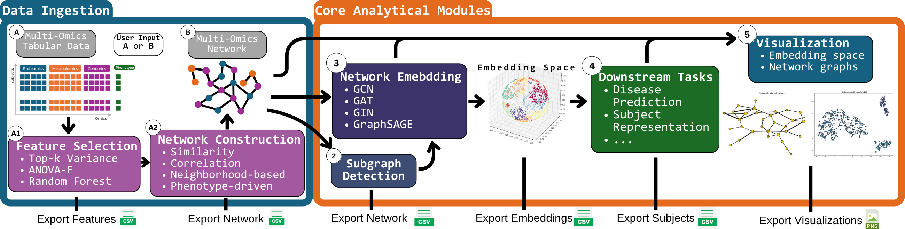

# BioNeuralNet: A Graph-Based Multi-Omics Integration and Embedding Framework for Advanced Analytics


## Overview

**BioNeuralNet** is a Python-based framework designed to integrate and analyze multi-omics data through advanced neural network embeddings. It streamlines complex workflows, enabling researchers to transform high-dimensional biological data into meaningful insights for biomarker discovery, disease prediction, and more.



## Key Features

BioNeuralNet encompasses five core components:

1. **Graph Construction**: Build multi-omics networks using methods like Weighted Gene Co-expression Network Analysis (**WGCNA**), Sparse Multiple Canonical Correlation Network (**SmCCNet**), or import existing networks.
2. **Graph Clustering**: Identify functional modules and communities using hierarchical clustering, PageRank, or Louvain clustering algorithms.
3. **Network Embedding**: Generate embeddings with **Graph Neural Networks (GNNs)** or **Node2Vec**, simplifying high-dimensional data into lower-dimensional representations.
4. **Subject Representation**: Integrate embeddings into omics data to enrich subject-level features, enhancing the dataset for downstream analyses.
5. **Downstream Tasks**: Perform advanced analyses like disease prediction using network information. Seamlessly integrate your own downstream tasks by leveraging existing components.

**Additional Features:**
- Supports static and dynamic network visualizations for intuitive exploration of network structures and results.
- CUDA-based GPU acceleration for enhanced computational performance.

## Installation

### Quick Installation via pip

Ensure you have Python 3.10 or 3.11 installed. Then, install BioNeuralNet using pip:

```bash
pip install bioneuralnet==0.1.0b1
```

### Installation with Dependencies

BioNeuralNet relies on various Python and R packages for data processing and graph generation. Use the provided `fast-install.py` script for an automated setup.

1. **Clone the Repository:**

   ```bash
   git clone https://github.com/UCD-BDLab/BioNeuralNet.git
   cd BioNeuralNet
   ```

2. **Run the Fast Install Script:**

   ```bash
   python3 scripts/fast-install.py
   ```

   

   **Installation Options:**
   - **GPU-acceleration**: Install GPU-accelerated PyTorch by specifying the `--cuda` argument. To use a specific CUDA version (e.g., 12.1), include the `--cuda-version` argument:

     ```bash
     python3 scripts/fast-install.py --cuda --cuda-version 12.1
     ```

   - **Development Dependencies**: Install additional dependencies for testing, documentation, or contributing with the `--dev` argument:

     ```bash
     python3 scripts/fast-install.py --dev
     ```

   - **Combined Installation**: Install both CUDA support and development dependencies:

     ```bash
     python3 scripts/fast-install.py --cuda --cuda-version 11.8 --dev
     ```

   **Available Arguments:**
   - `--cuda`: Enable GPU-accelerated PyTorch installation.
   - `--cuda-version`: Specify a CUDA version (11.8, 12.1, or 12.4).
   - `--dev`: Install development dependencies.

### More Installation Methods

For alternative installation methods and detailed step-by-step instructions (e.g., using .zip downloads instead of git clone), visit the[Installation Guide](https://bioneuralnet.readthedocs.io/en/latest/install.html).

## Quick Example

Here's a quick example demonstrating how to generate a network representation using **SmCCNet** and apply it to disease prediction using **DPMON**:

```python
import pandas as pd
from bioneuralnet.graph_generation import SmCCNet
from bioneuralnet.downstream_task import DPMON

# Step 1: Load Multi-Omics Dataset
omics_data = pd.read_csv('omics_data.csv', index_col=0)
phenotype_data = pd.read_csv('phenotype_data.csv', index_col=0)

# Step 2: Generate a network using SmCCNet
smccnet = SmCCNet(phenotype_data=phenotype_data, omics_data=omics_data)
adjacency_matrix = smccnet.run()
print("Multi-Omics Network generated.")

# Step 3: Enhanced disease prediction using network information with DPMON
dpmon = DPMON(adjacency_matrix=adjacency_matrix, omics_list=[omics_data], phenotype_data=phenotype_data)
predictions = dpmon.run()
print("Disease phenotype predictions:")
print(predictions)
```

**Output:**
- **Adjacency Matrix**: The network representation of the multi-omics data.
- **Predictions**: Disease phenotype predictions for each sample.


## Documentation & Examples

Comprehensive documentation, tutorials, and example workflows are available at [BioNeuralNet - Read The Docs](https://bioneuralnet.readthedocs.io/en/latest/index.html).

**What’s Included:**
- Detailed pipeline overviews
- Step-by-step tutorials
- API references
- End-to-end workflow examples

Explore example scripts in the `turorials/` tab.

## Frequently Asked Questions (FAQ)

For a comprehensive list of FAQs, visit the [FAQ](https://bioneuralnet.readthedocs.io/en/latest/faq.html) section in the documentation.

### Highlights:

- **What is BioNeuralNet?**
- **Key components of BioNeuralNet**
- **Installation instructions**
- **GPU acceleration**
- **Contribution guidelines**
- **Reporting issues and requesting features**
- **License information**
- **Acknowledgments**

## Acknowledgements

BioNeuralNet leverages several open-source libraries and tools that are integral to its functionality:

- [SmCCNet on CRAN](https://cran.r-project.org/package=SmCCNet)
- [WGCNA on CRAN](https://cran.r-project.org/package=WGCNA)
- [Node2Vec on GitHub](https://github.com/aditya-grover/node2vec)
- [PyTorch](https://pytorch.org/)
- [PyTorch Geometric](https://github.com/pyg-team/pytorch_geometric)
- [dplyr on CRAN](https://cran.r-project.org/package=dplyr)
- [Pytest](https://pytest.org/)
- [Pre-commit](https://github.com/pre-commit/pre-commit)
- [Sphinx](https://www.sphinx-doc.org/)
- [Black](https://black.readthedocs.io/)
- [Flake8](https://flake8.pycqa.org/)

We extend our gratitude to all contributors and open-source communities that have made BioNeuralNet possible.

## Testing

BioNeuralNet ensures reliability through automated tests and Continuous Integration (CI) workflows.

### Running Tests Locally

1. **Install Development Dependencies:**

   ```bash
   pip install -r requirements-dev.txt
   ```

2. **Run All Tests:**

   ```bash
   pytest
   ```

3. **View Coverage Reports:**

   ```bash
   pytest --cov=bioneuralnet --cov-report=html tests/
   open htmlcov/index.html  
   ```

### Continuous Integration

GitHub Actions ensure that all commits and pull requests:
- Install dependencies
- Run the test suite
- Enforce code quality and generate coverage reports

## Contributing

We welcome contributions! To contribute:

1. **Fork the Repository:**

   ```bash
   git clone https://github.com/UCD-BDLab/BioNeuralNet.git
   cd BioNeuralNet
   ```

2. **Create a Feature Branch:**

   ```bash
   git checkout -b feature/your-feature-name
   ```

3. **Install Development Dependencies:**

   ```bash
   ./setup.sh
   ```

4. **Make Your Changes:**
   - Implement new features.
   - Add or update tests.
   - Document your changes.

5. **Run Tests:**

   ```bash
   pytest
   ```

6. **Commit Changes:**

   ```bash
   git add .
   git commit -m "Add feature XYZ"
   ```

7. **Push and Open a Pull Request:**

   ```bash
   git push origin feature/your-feature-name
   ```

For detailed guidelines, refer to the [FAQ](https://bioneuralnet.readthedocs.io/en/latest/faq.html) section in the documentation.

## License & Contact

- **License:** [MIT License](https://github.com/UCD-BDLab/BioNeuralNet/blob/main/LICENSE)

- **Contact:**
  For questions, issues, or feature requests, please open an issue on the [GitHub repository](https://github.com/UCD-BDLab/BioNeuralNet/issues) or contact the maintainer at **vicente.ramos@ucdenver.edu**.

---

For an in-depth look at BioNeuralNet, refer to the [Documentation](https://bioneuralnet.readthedocs.io/en/latest/index.html) and example workflows in the `turorial/` directory.
