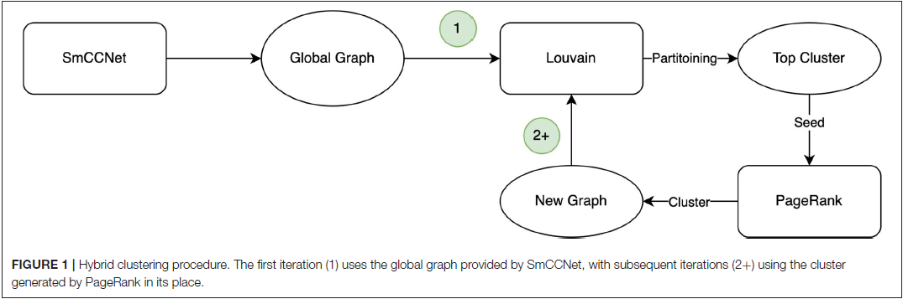
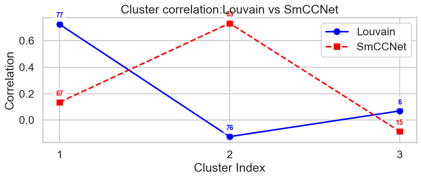

Correlated Clustering
=====================

BioNeuralNet provides **correlated clustering methods** designed specifically to identify biologically relevant communities within multi-omics networks. By integrating **phenotype correlations**, these approaches enhance traditional community detection methods, capturing biologically meaningful network modules strongly associated with clinical or phenotypic outcomes.

Key Features
------------
- **Phenotype-Aware Clustering**: Incorporates external phenotype information directly into clustering algorithms, resulting in communities that are both structurally cohesive and biologically meaningful.
- **Flexible Application**: Methods are applicable to any network data represented as adjacency matrices, facilitating diverse research scenarios including biomarker discovery and functional module identification.
- **Integration with Downstream Analysis**: Clusters obtained can directly feed into downstream tasks such as disease prediction, feature selection, and biomarker identification.

Supported Clustering Methods
----------------------------

Correlated PageRank
-------------------
A variant of PageRank that biases node rankings toward phenotype-relevant nodes, prioritizing features with strong phenotype associations:

.. math::

     \mathbf{r} = \alpha \cdot \mathbf{M} \mathbf{r} + (1 - \alpha) \mathbf{p}

- :math:`\mathbf{M}`: Normalized adjacency (transition probability matrix).
- :math:`\mathbf{p}`: Phenotype-informed personalization vector (based on correlation).
- Ideal for ranking biologically impactful nodes.

Correlated Louvain
------------------
Modifies Louvain community detection to balance structural modularity and phenotype correlation, optimizing:

.. math::

       Q^* = k_L \cdot Q + (1 - k_L) \cdot \overline{\lvert \rho \rvert}

- :math:`Q`: Newman-Girvan modularity, measuring network structural cohesiveness.
- :math:`\overline{\lvert \rho \rvert}`: Mean absolute Pearson correlation between cluster features and phenotype.
- :math:`k_L`: User-defined parameter balancing structure and phenotype relevance.
- Efficient for identifying phenotype-enriched communities.

Hybrid Louvain (Iterative Refinement)
-------------------------------------
Combines Correlated Louvain with Correlated PageRank iteratively to refine community assignments:

1. Initial clustering using Correlated Louvain identifies phenotype-associated modules.
2. Clusters iteratively refined by expanding highly correlated modules using Correlated PageRank.
3. Repeated until convergence, producing optimized phenotype-associated communities.

   Workflow: Hybrid Louvain iteratively integrates Correlated PageRank and Correlated Louvain to produce refined phenotype-associated clusters.

Comparison of Methods
---------------------
The figure below illustrates the difference between standard and correlated clustering methods, highlighting BioNeuralNet's ability to extract biologically meaningful modules.

   Comparison: Standard (SmCCNet) versus Correlated Louvain clusters.

Applications and Use Cases
--------------------------
BioNeuralNet correlated clustering is versatile and suitable for diverse network analyses:

- **Multi-Omics Networks**: Extract biologically relevant gene/protein modules associated with clinical phenotypes.
- **Neuroimaging Networks**: Identify functional brain modules linked to neurological diseases.
- **Disease Networks**: Reveal patient or epidemiological network communities strongly linked to clinical outcomes.

Integration into BioNeuralNet Workflow
--------------------------------------
Clustering outputs seamlessly feed into downstream BioNeuralNet modules:

- **GNN Embedding Generation**: Train Graph Neural Networks on phenotype-enriched clusters.
- **Disease Prediction (DPMON)**: Utilize phenotype-associated modules for improved predictive accuracy.
- **Biomarker Discovery**: Extract features or modules strongly predictive of disease status.

User Recommendations
--------------------
- **Correlated PageRank**: Best for prioritizing individual high-impact features or nodes.
- **Correlated Louvain**: Ideal for extracting phenotype-associated functional communities efficiently.
- **Hybrid Louvain**: Recommended for maximal biological interpretability, particularly in complex multi-omics scenarios.

Reference and Further Reading
-----------------------------
For detailed methodology and benchmarking, refer to our publication:

- Abdel-Hafiz et al., Frontiers in Big Data, 2022. [1]_

Return to :doc:`../index`

.. [1] Abdel-Hafiz, M., Najafi, M., et al. "Significant Subgraph Detection in Multi-omics Networks for Disease Pathway Identification." *Frontiers in Big Data*, 5 (2022). DOI: `10.3389/fdata.2022.894632 <https://doi.org/10.3389/fdata.2022.894632>`_.

