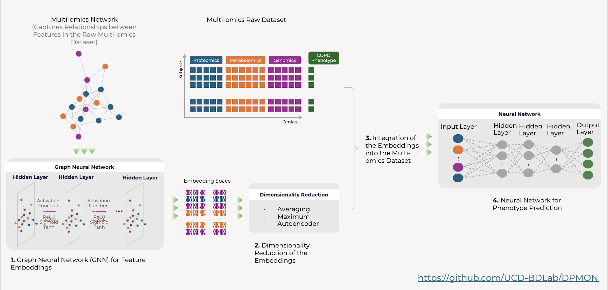

Downstream Tasks
================

BioNeuralNet's core innovation is the generation of low-dimensional embeddings that unlock a variety of downstream applications. By reducing the complexity of multi-omics data, these embeddings not only boost computational efficiency but also improve the accuracy of predictive models and enable exploratory analyses.

Overview
--------

The embeddings generated by Graph Neural Networks (GNNs) serve as a transformative feature of BioNeuralNet. They allow users to:

- **Predict Disease Outcomes**: Using the end-to-end DPMON pipeline.
- **Enhance Subject Representation**: By integrating embeddings back into omics data, thus enriching patient-level profiles.
- **Facilitate Other Downstream Analyses**: Such as clustering, biomarker discovery, and visualization.

.. image:: _static/Overview.png
   :align: center
   :alt: Overview of Downstream Tasks
   :width: 90%

DPMON: Disease Prediction Pipeline
----------------------------------

The **DPMON** module provides a seamless, end-to-end workflow for disease prediction. It combines the network adjacency matrix, GNN-based embeddings, and subject-level data to deliver robust predictions. With built-in hyperparameter tuning, DPMON adapts to your data for optimal performance.

Example Usage:

.. code-block:: python

   import pandas as pd
   from bioneuralnet.external_tools import SmCCNet
   from bioneuralnet.downstream_task import DPMON
   from bioneuralnet.datasets import DatasetLoader

   # Step 1: Load your data or use one of the provided datasets
   Example = DatasetLoader("example1")
   omics_genes = Example.data["X1"]
   omics_proteins = Example.data["X2"]
   phenotype = Example.data["Y"]
   clinical = Example.data["clinical_data"]

   # Step 2: Network Construction
   smccnet = SmCCNet(
       phenotype_df=phenotype,
       omics_dfs=[omics_genes, omics_proteins],
       data_types=["Genes", "Proteins"],
       kfold=5,
       summarization="PCA",
   )
   global_network, clusters = smccnet.run()
   print("Adjacency matrix generated.")

   # Step 3: Disease Prediction (DPMON)
   dpmon = DPMON(
       adjacency_matrix=global_network,
       omics_list=[omics_genes, omics_proteins],
       phenotype_data=phenotype,
       clinical_data=clinical,
       model="GCN",
   )
   predictions, avg_accuracy = dpmon.run()
   print("Disease phenotype predictions:\n", predictions)

Subject Representation & Embedding Integration
-----------------------------------------------

Beyond disease prediction, the learned embeddings can be re-integrated into subject-level data to enrich the feature set. This enhanced subject representation supports downstream tasks such as:

- **Biomarker Discovery**: Identifying key omics features that drive disease.
- **Enhanced Clustering**: Grouping patients more effectively based on integrated data.
- **Data Visualization**: Leveraging low-dimensional representations for intuitive plotting and network analysis.

.. image:: _static/SubjectRepresentation.png
   :align: center
   :alt: Subject Representation Workflow
   :width: 80%

Unlocking Downstream Applications
---------------------------------

By lowering the dimensionality, BioNeuralNet's embeddings simplify complex multi-omics data into actionable insights. This approach:

- **Accelerates Predictive Modeling**: Making it easier to integrate with machine learning frameworks.
- **Improves Interpretability**: Allowing users to trace back the contribution of each omics feature.
- **Enables Custom Workflows**: While we support key pipelines like DPMON out-of-the-box, the embeddings can also be used in custom downstream applications.

Other downstream tasks include, but are not limited to:

- **Predictive Analytics**
- **Community Detection in Networks**
- **Interactive Data Exploration**

Get Started
-----------

BioNeuralNet is designed not only to provide robust downstream pipelines but also to empower researchers to develop their own custom analyses. With the combination of disease prediction, subject representation, and other downstream tools, users can seamlessly integrate these components into their broader multi-omics workflows.

For further details, check out our end-to-end jupyter notebook and code tutorials:

   - :doc:`Quick_Start`
   - :doc:`TCGA-BRCA_Dataset`
   - :doc:`tutorials/example_1`
   - :doc:`tutorials/example_2`

References
----------
For more in-depth information on the methodologies and models, please refer to the related documentation pages and our published works.

Return to :doc:`../index`
