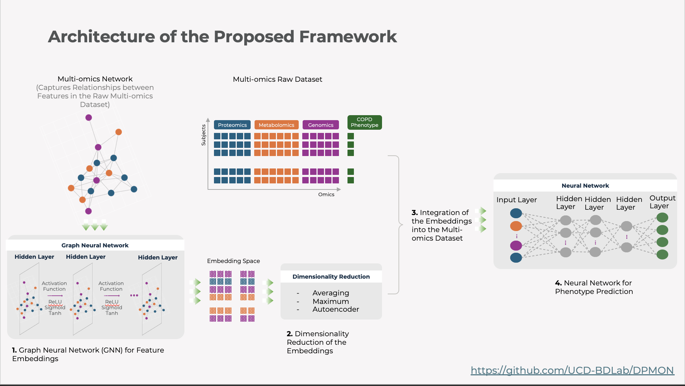

Example 1: SmCCNet + DPMON for Disease Prediction
=================================================

This tutorial illustrates how to:

1. **Build** an adjacency matrix with SmCCNet.
2. **Predict** disease phenotypes using DPMON.

**Workflow**:

1. **Data Preparation**:
   - Load multi-omics, phenotype, and clinical data using DatasetLoader.

2. **Network Construction**:
   - Use `auto_pysmccnet()` to create an adjacency matrix from the combined omics data.

3. **Disease Prediction**:
   - `DPMON` integrates the adjacency matrix, omics data, and phenotype data to train a GNN-based classifier.

4. **Diagram of the workflow**: The figure below illustrates the process.

   Embedding-enhanced subject data using DPMON for improved disease prediction.

`View full-size image: Disease Prediction (DPMON) <https://bioneuralnet.readthedocs.io/en/latest/_images/DPMON.png>`_

**Step-by-Step Instructions**:

1. **Data Setup**:
   - Load synthetic multi-omics, phenotype, and clinical data using `DatasetLoader`.

2. **Network Construction (SmCCNet)**:
   - Call `auto_pysmccnet()` to produce an adjacency matrix from the omics data.

3. **Disease Prediction (DPMON)**:
   - Pass the adjacency, omics, phenotype, and clinical data into `DPMON`.
   - Run `.run()` to predict disease phenotypes.

Below is a **complete** Python implementation:

.. code-block:: python

   import pandas as pd
   from bioneuralnet.network import auto_pysmccnet
   from bioneuralnet.downstream_task import DPMON
   from bioneuralnet.datasets import DatasetLoader

   # Step 1: Load your data or use one of the provided datasets
   Example = DatasetLoader("example")
   omics_genes = Example.data["X1"]
   omics_proteins = Example.data["X2"]
   phenotype = Example.data["Y"]
   clinical = Example.data["clinical_data"]

   # Step 2: Network Construction
   result = auto_pysmccnet(
      X=[omics1, omics2],
      Y=phenotype,
      DataType=["genes", "mirna"],
      subSampNum=1000,
      seed=SEED,
      Kfold=3,
      BetweenShrinkage=5,
      CutHeight=1 - 0.1**10,
      summarization="NetSHy",
   )

   global_network = result["AdjacencyMatrix"]
   subnetworks = result["Subnetworks"]
   
   print("Adjacency matrix generated.")

   # Step 3: Disease Prediction (DPMON)
   dpmon = DPMON(
       adjacency_matrix=global_network,
       omics_list=[omics_genes, omics_proteins],
       phenotype_data=phenotype,
       clinical_data=clinical,
       model="GCN",
   )
   predictions, avg_accuracy = dpmon.run()
   print("Disease phenotype predictions:\n", predictions)

**Output**:
- **Adjacency Matrix**: Generated using SmCCNet.
- **Predictions**: Phenotype predictions for each subject.
