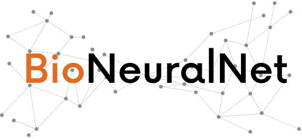
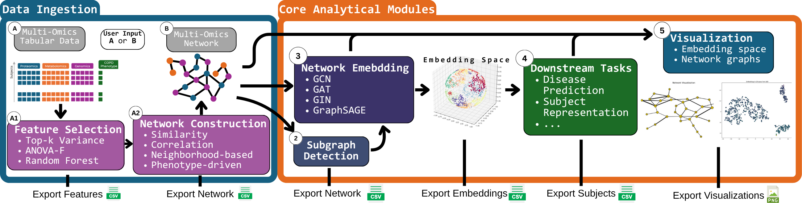

BioNeuralNet: Graph Neural Networks for Multi-Omics Network Analysis
====================================================================

.. image:: https://img.shields.io/badge/License-CC%20BY--NC--ND%204.0-lightgrey.svg
   :target: https://creativecommons.org/licenses/by-nc-nd/4.0/

.. image:: https://img.shields.io/pypi/v/bioneuralnet
   :target: https://pypi.org/project/bioneuralnet/

.. image:: https://static.pepy.tech/badge/bioneuralnet
   :target: https://pepy.tech/project/bioneuralnet

.. image:: https://img.shields.io/badge/GitHub-View%20Code-blue
   :target: https://github.com/UCD-BDLab/BioNeuralNet

.. image:: https://zenodo.org/badge/DOI/10.5281/zenodo.17503083.svg
   :target: https://doi.org/10.5281/zenodo.17503083

Installation
------------

BioNeuralNet is available as a Python package on PyPI:

.. code-block:: bash

   pip install bioneuralnet

For additional installation details and troubleshooting, see :doc:`installation`.

Quick Start Examples
--------------------

Get started quickly with these end-to-end examples demonstrating the BioNeuralNet workflow:

- :doc:`Quick_Start`
- :doc:`notebooks/index`

**BioNeuralNet Workflow Overview**
----------------------------------

   `View BioNeuralNet Workflow. <https://bioneuralnet.readthedocs.io/en/latest/_images/BioNeuralNet.png>`_

What is BioNeuralNet?
---------------------

BioNeuralNet is a flexible and modular Python framework tailored for **end-to-end network-based multi-omics data analysis**. It leverages Graph Neural Networks (GNNs) to learn biologically meaningful low-dimensional representations from multi-omics networks, converting complex molecular interactions into versatile embeddings.

**Core Analytical Modules:**

- **Network Construction**: Build informative networks from raw tabular data using strategies like **Similarity**, **Correlation**, **Neighborhood-based**, or **Phenotype-driven** (e.g., SmCCNet) approaches.
- **Biomarker Discovery**: Identify biological modules and key molecular interactions that drive disease phenotypes.
- **Disease Prediction**: Implement end-to-end supervised disease classification using the **DPMON** (Disease Prediction using Multi-Omics Networks) module.
- **Subject Representation**: Generate enhanced subject-level embeddings for stratification and clustering.

**Visualizing Multi-Omics Networks**

BioNeuralNet allows you to inspect the topology of your constructed networks. The visualization below, from our **TCGA Kidney Cancer (KIPAN)** analysis, highlights a module of highly interacting genes and proteins.

.. figure:: _static/kipan_net.png
   :align: center
   :alt: Multi-Omics Network Visualization
   :width: 90%

   *Network visualization of a highly connected gene module identified in the KIPAN dataset.*

**Top Identified Biomarkers (Hub Omics)**

The table below lists the top hub features identified in the network above, ranked by their degree centrality.

.. list-table:: Omics with high degree
   :widths: 50 25
   :header-rows: 1
   :align: center

   * - Feature Name (Omic)
     - Degree
   * - INPP5J_27124
     - 12
   * - SLC26A7_115111
     - 9
   * - HEPACAM2_253012
     - 7
   * - CLNK_116449
     - 7
   * - RHCG_51458
     - 6
   * - CLCNKB_1188
     - 6

Why Graph Neural Networks for Multi-Omics?
------------------------------------------

Traditional statistical methods typically represent multi-omics data as high-dimensional tabular matrices, often overlooking the intricate relationships and interactions between biomolecular entities. BioNeuralNet overcomes these limitations by using **Graph Neural Networks (GNNs)** to explicitly model multi-omics data as biological networks.

BioNeuralNet supports several GNN architectures suited to different biological contexts:

* **GCN**: Effective for uniformly connected graphs.
* **GAT**: Uses attention mechanisms to highlight key biological relationships.
* **GraphSAGE**: Designed for large or dynamic datasets.
* **GIN**: Sensitive to subtle feature variations in molecular structures.

**Network Embeddings**

By projecting high-dimensional omics networks into latent spaces, BioNeuralNet distills complex, nonlinear molecular relationships into compact vectorized representations. The t-SNE projection below reveals distinct clusters corresponding to different omics modalities (e.g., DNA Methylation, RNA, miRNA).

.. figure:: _static/emb_kipan.png
   :align: center
   :alt: t-SNE visualization of Network Embeddings
   :width: 90%

   *2D projection of Network Embeddings showing distinct separation between omics modalities.*

For detailed explanations of BioNeuralNet's supported GNN architectures, see :doc:`gnns`.

Key Considerations for Robust Analysis
--------------------------------------

To ensure scientific rigor and optimal performance when using BioNeuralNet, users should consider the following best practices:

* **Network Topology Sensitivity**: Performance is inherently tied to the quality of the constructed network. We recommend comparing multiple network construction strategies (e.g., Correlation vs Similarity) within BioNeuralNet to benchmark different topologies.
* **Feature Selection Impact**: Results depend heavily on input features. BioNeuralNet supports various preselection strategies (Top-k Variance, ANOVA-F, Random Forest), which often yield complementary biological insights.
* **Handling Missing Data**: Incomplete multi-omics data is common. BioNeuralNet provides utilities like ``impute_omics`` and ``impute_omics_knn`` to handle missing values within modalities.
* **Computational Scalability**: While optimized for standard omics datasets, extremely large networks may require aggressive feature reduction or subgraph detection strategies to maintain computational efficiency.
* **Interpretability Scope**: BioNeuralNet provides network-level interpretability (identifying key modules and hub features). However, full node-level explainability remains an active area of research.

Explore BioNeuralNet's Documentation
------------------------------------

For detailed examples and tutorials, visit:

- :doc:`Quick_Start`: A quick walkthrough demonstrating the BioNeuralNet workflow from start to finish.
- :doc:`notebooks/index`: A collection of demonstration notebooks showcasing end-to-end analyses on TCGA datasets.

**Documentation Sections:**

- :doc:`gnns`: Overview of supported GNN architectures (GCN, GAT, GraphSAGE, GIN) and embedding generation.
- :doc:`subgraph`: How to identify biologically relevant functional modules using correlated clustering methods.
- :doc:`downstream_tasks`: Performing downstream analyses such as subject representation and phenotype prediction (DPMON).
- :doc:`metrics`: Methods for visualization, quality evaluation, and performance benchmarking.
- :doc:`utils`: Tools for preprocessing, feature selection, network construction, and data summarization.
- :doc:`external_tools/index`: Integration of external methods, such as SmCCNet, for advanced network construction.
- :doc:`user_api`: Detailed API documentation for developers and advanced users.

Contributing to BioNeuralNet
----------------------------

We welcome contributions to BioNeuralNet! If you have ideas for new features, improvements, or bug fixes, please follow these steps:

- **Ways to contribute**:
   
   - Report issues or bugs on our `GitHub Issues page <https://github.com/UCD-BDLab/BioNeuralNet/issues>`_.
   - Suggest new features or improvements.
   - Share your experiences or use cases with the community.

- **Implementing new features**:

   - Fork the repo and create a feature branch `UCD-BDLab/BioNeuralNet <https://github.com/UCD-BDLab/BioNeuralNet>`_.
   - Add tests and documentation for new features.
   - Run the test suite and and pre-commit hooks before opening a Pull Request(PR).
   - A new PR should pass all tests and adhere to the project's coding standards.

   .. code-block:: bash
      
      git clone https://github.com/UCD-BDLab/BioNeuralNet.git
      cd BioNeuralNet
      pip install -r requirements-dev.txt
      pre-commit install
      pytest --cov=bioneuralnet

Citation
--------

If you use BioNeuralNet in your research, we kindly ask that you cite our paper:

   Ramos, V., Hussein, S., et al. (2025).
   `BioNeuralNet: A Graph Neural Network based Multi-Omics Network Data Analysis Tool <https://arxiv.org/abs/2507.20440>`_.
   *arXiv preprint arXiv:2507.20440* | `DOI: 10.48550/arXiv.2507.20440 <https://doi.org/10.48550/arXiv.2507.20440>`_.

.. toctree::
   :maxdepth: 2
   :caption: Contents:

   installation

   gnns
   subgraph
   metrics
   utils
   downstream_tasks
   datasets
   Quick_Start.ipynb
   quick_start_bio
   notebooks/index
   examples/index
   external_tools/index
   user_api
   faq

Indices and References
======================
* :ref:`genindex`
* :ref:`modindex`
* :ref:`search`

.. [1] Liu, W., Vu, T., Konigsberg, I. R., Pratte, K. A., Zhuang, Y., & Kechris, K. J. (2023). "Network-Based Integration of Multi-Omics Data for Biomarker Discovery and Phenotype Prediction." *Bioinformatics*, 39(5), btat204. DOI: `10.1093/bioinformatics/btat204 <https://doi.org/10.1093/bioinformatics/btat204>`_.
.. [2] Hussein, S., Ramos, V., et al. "Learning from Multi-Omics Networks to Enhance Disease Prediction: An Optimized Network Embedding and Fusion Approach." In *2024 IEEE International Conference on Bioinformatics and Biomedicine (BIBM)*, Lisbon, Portugal, 2024, pp. 4371-4378. DOI: `10.1109/BIBM62325.2024.10822233 <https://doi.org/10.1109/BIBM62325.2024.10822233>`_.