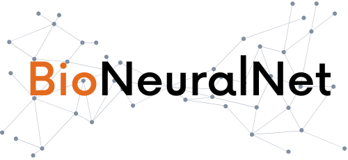
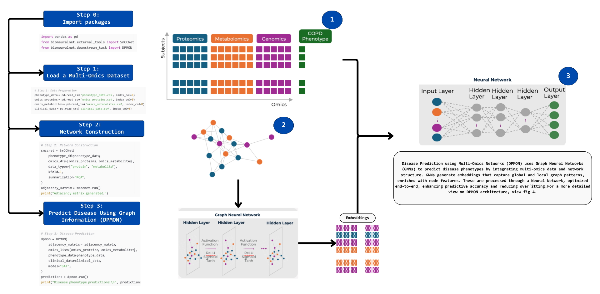

Welcome to BioNeuralNet Beta 0.2
================================

.. image:: https://img.shields.io/badge/license-MIT-blue.svg
   :target: https://github.com/UCD-BDLab/BioNeuralNet/blob/main/LICENSE

.. image:: https://img.shields.io/pypi/v/bioneuralnet
   :target: https://pypi.org/project/bioneuralnet/

.. image:: https://static.pepy.tech/badge/bioneuralnet
   :target: https://pepy.tech/project/bioneuralnet

.. image:: https://img.shields.io/badge/GitHub-View%20Code-blue
   :target: https://github.com/UCD-BDLab/BioNeuralNet

BioNeuralNet – Advanced Multi-Omics Integration with GNNs
==========================================================

.. note::

   **This is a BETA version of BioNeuralNet.**  
   It is under active development, and certain features may be incomplete or subject to change.  
   Your feedback and bug reports are highly encouraged to help us refine and improve the tool.

Installation
------------
To install BioNeuralNet, simply run:

.. code-block:: bash

   pip install bioneuralnet

For additional installation details, including **GPU acceleration for GNNs**, see :doc:`installation`.

What is BioNeuralNet?
---------------------
BioNeuralNet is a **Python-based** framework designed to bridge the gap between **multi-omics data analysis** and **Graph Neural Networks (GNNs)**. By leveraging advanced techniques, it enables:

- **Graph Clustering**: Identify biologically meaningful communities within omics networks.  
- **GNN Embeddings**: Learn network-based feature representations from biological graphs.  
- **Subject Representation**: Generate high-quality embeddings for individuals based on multi-omics profiles.  
- **Disease Prediction**: Build predictive models using integrated multi-layer biological networks.

Seamless Data Integration
-------------------------
One of BioNeuralNet's core strengths is **interoperability**:

- Outputs are structured as **pandas DataFrames**, allowing easy downstream analysis.  
- Supports integration with external tools, making it adaptable to various research workflows.  
- Works effortlessly with network-based and machine learning pipelines.

.. note::
   **External Tools**:

   - BioNeuralNet offers external tools available through the `bioneuralnet.external_tools` module.
   - These lightweight wrappers (e.g., for WGCNA, SmCCNet, Node2Vec) facilitate testing and integration, but they are not mandatory to use the core functionality.
   - We highly encourage users to explore these tools to fully leverage their capabilities.

**Example: Transforming Multi-Omics for Enhanced Disease Prediction**
---------------------------------------------------------------------

`View full-size image: Transforming Multi-Omics for Enhanced Disease Prediction <https://bioneuralnet.readthedocs.io/en/latest/_images/Overview.png>`_

   **BioNeuralNet**: Transforming Multi-Omics for Enhanced Disease Prediction

Below is a quick example demonstrating the following steps:

1. **Data Preparation**:

   - Input your multi-omics data (e.g., proteomics, metabolomics) along with phenotype and clinical data.

2. **Network Construction**:

   - **Not performed internally**: Generate the network adjacency matrix externally (e.g., using SmCCNet).
   - Lightweight wrappers (e.g., WGCNA, SmCCNet) are available in `bioneuralnet.external_tools` for convenience.

3. **Disease Prediction**:

   - Use **DPMON** to predict disease phenotypes by integrating the network information with omics data.
   - DPMON supports an end-to-end pipeline with hyperparameter tuning that can return predictions as pandas DataFrames, enabling seamless integration with existing workflows.

**Code Example**:

.. code-block:: python

   import pandas as pd
   from bioneuralnet.external_tools import SmCCNet
   from bioneuralnet.downstream_task import DPMON

   # Step 1: Data Preparation
   phenotype_data = pd.read_csv('phenotype_data.csv', index_col=0)
   omics_proteins = pd.read_csv('omics_proteins.csv', index_col=0)
   omics_metabolites = pd.read_csv('omics_metabolites.csv', index_col=0)
   clinical_data = pd.read_csv('clinical_data.csv', index_col=0)

   # Step 2: Network Construction
   smccnet = SmCCNet(
       phenotype_df=phenotype_data,
       omics_dfs=[omics_proteins, omics_metabolites],
       data_types=["protein", "metabolite"],
       kfold=5,
       summarization="PCA",
   )
   adjacency_matrix = smccnet.run()
   print("Adjacency matrix generated.")

   # Step 3: Disease Prediction (DPMON)
   dpmon = DPMON(
       adjacency_matrix=adjacency_matrix,
       omics_list=[omics_proteins, omics_metabolites],
       phenotype_data=phenotype_data,
       clinical_data=clinical_data,
       model="GCN",
   )
   predictions = dpmon.run()
   print("Disease phenotype predictions:\n", predictions)

**BioNeuralNet Overview: Multi-Omics Integration with Graph Neural Networks**
-----------------------------------------------------------------------------

BioNeuralNet offers five core steps in a typical workflow:

1. **Graph Construction**:

   - **Not** performed internally. You provide or build adjacency matrices externally (e.g., via WGCNA, SmCCNet, or your own scripts).
   - All modules are designed to integrate seamlessly with pandas—most functions offer options to return results as pandas DataFrames, enabling you to incorporate BioNeuralNet outputs directly into your existing workflows.

2. **Graph Clustering**:

   - Identify functional modules or communities using **correlated clustering methods** (e.g., CorrelatedPageRank, CorrelatedLouvain, HybridLouvain) that integrate phenotype correlation to extract biologically relevant modules [1]_.
   - Clustering modules can return either raw partitions or induced subnetwork adjacency matrices (as DataFrames) for visualization.

3. **Network Embedding**:

   - Generate embeddings using methods such as **GCN**, **GAT**, **GraphSAGE**, and **GIN**.
   - Outputs can be obtained as native tensors or converted to pandas DataFrames for easy analysis and visualization.

4. **Subject Representation**:

   - Integrate node embeddings back into omics data to enrich subject-level profiles by weighting features with learned embedding scalars.
   - The result can be returned as a DataFrame or a tensor, fitting naturally into downstream analyses.

5. **Downstream Tasks**:

   - Execute end-to-end pipelines for disease prediction using **DPMON** [2]_.
   - DPMON supports hyperparameter tuning—when enabled, it finds the best configuration and then performs standard training to produce final predictions as a pandas DataFrame.
   - This approach, along with the native pandas integration across modules, ensures that BioNeuralNet can be easily incorporated into your analysis workflows.

.. toctree::
   :maxdepth: 2
   :caption: Contents:

   installation
   TOPMED.ipynb
   gnns
   clustering
   tutorials/index
   tools/index
   external_tools/index
   future
   user_api
   faq
   clustering

Indices and References
======================
* :ref:`genindex`
* :ref:`modindex`
* :ref:`search`

.. [1] Abdel-Hafiz, M., Najafi, M., et al. "Significant Subgraph Detection in Multi-omics Networks for Disease Pathway Identification." *Frontiers in Big Data*, 5 (2022). DOI: `10.3389/fdata.2022.894632 <https://doi.org/10.3389/fdata.2022.894632>`_.
.. [2] Hussein, S., Ramos, V., et al. "Learning from Multi-Omics Networks to Enhance Disease Prediction: An Optimized Network Embedding and Fusion Approach." In *2024 IEEE International Conference on Bioinformatics and Biomedicine (BIBM)*, Lisbon, Portugal, 2024, pp. 4371-4378. DOI: `10.1109/BIBM62325.2024.10822233 <https://doi.org/10.1109/BIBM62325.2024.10822233>`_.
