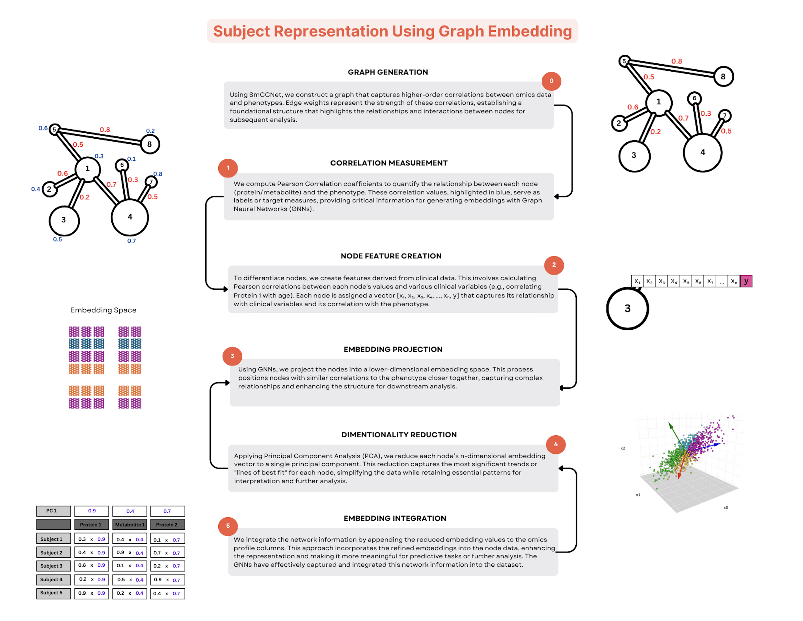

.. BioNeuralNet documentation master file

Welcome to BioNeuralNet Beta 0.1
================================

**Note:** This is a **beta version** of BioNeuralNet. It is under active development, and certain features
may be incomplete or subject to change. Feedback and bug reports are highly encouraged to help us
improve the tool.

BioNeuralNet is a Python-based software tool designed to streamline the integration of multi-omics
data with **Graph Neural Network (GNN)** embeddings. It supports **graph clustering**, **subject representation**,
and **disease prediction**, enabling advanced analyses of complex multi-omics networks.

**Python Installation via pip**:

   .. code-block:: bash

      pip install bioneuralnet==0.1.0b1

For additional installation details, including GPU usage for GNNs, see :doc:`installation`.

**Example: Transforming Multi-Omics for Enhanced Disease Prediction**
---------------------------------------------------------------------

`View full-size image: Transforming Multi-Omics for Enhanced Disease Prediction <https://ramosv.github.io/_images/Overview.png>`_

.. figure:: _static/Overview.png
   :align: center
   :alt: BioNeuralNet Overview

   **BioNeuralNet**: Transforming Multi-Omics for Enhanced Disease Prediction

Below is a quick example demonstrating **(1) building or importing** a network adjacency matrix
(e.g., with SmCCNet) and **(2) using DPMON** for disease prediction:

.. note::

   1. **Data Preparation**:
      - Input your multi-omics data (e.g., proteomics, metabolomics, genomics) plus phenotype data.

   2. **Network Construction**:
      - Not performed internally. You provide or build adjacency matrices externally (e.g., via WGCNA, SmCCNet, or your own scripts).
      - We provide lightweight wrappers in bioneuralnet.external_tools (WGCNA, SmCCNet) if you wish, but these are not mandatory for BioNeuralNet’s pipeline.

   3. **Disease Prediction**:
      - **DPMON** fuses GNN-based node embeddings with a downstream neural network to predict disease phenotypes.

**Code Example**:

.. code-block:: python

   import pandas as pd
   from bioneuralnet.external_tools import SmCCNet
   from bioneuralnet.downstream_task import DPMON

   omics_data = pd.read_csv('omics_data.csv', index_col=0)
   phenotype_data = pd.read_csv('phenotype_data.csv', index_col=0)

   smccnet = SmCCNet(phenotype_data=phenotype_data, omics_data=omics_data)
   adjacency_matrix = smccnet.run()
   print("Multi-Omics Network generated via SmCCNet.")

   dpmon = DPMON(adjacency_matrix=adjacency_matrix, omics_list=[omics_data], phenotype_data=phenotype_data)
   predictions = dpmon.run()
   print("Disease phenotype predictions:\n", predictions)

**Output**:
  - **Adjacency Matrix**: The multi-omics network representation.
  - **Predictions**: Disease phenotype predictions for each sample.

.. note::
   **External Tools**:
   - We offer a number of external tools availble through the `bioneuralnet.external_tools` module.
   - These tools were implemented to facilitate testing, and should not be considered part of the package's core functionality.
   - The classes inside the `external_tools` module are lightweight wrappers around existing tools and libraries offering minimal functionality.
   - We highly encourage users to explore these tools outside of BioNeuralNet to fully leverage their capabilities.

**BioNeuralNet Overview**
-------------------------

Below is a brief overview of BioNeuralNet's five main components:

1. **Graph Construction**: (External or custom) Build or import adjacency matrices from WGCNA, SmCCNet, etc.
2. **Graph Clustering**: Identify modules or communities using Hierarchical Clustering, PageRank, or Louvain.
3. **Network Embedding**: Use GNNs or Node2Vec to embed multi-omics networks into lower dimensions.
4. **Subject Representation**: Integrate embeddings into omics data for enriched subject-level features.
5. **Downstream Tasks**: Perform advanced tasks like disease prediction (DPMON). You can also integrate your own pipelines.

`View full-size image: BioNeuralNet Overview <https://ramosv.github.io/_images/BioNeuralNet.png>`_

.. figure:: _static/BioNeuralNet.png
   :align: center
   :alt: BioNeuralNet

   BioNeuralNet Overview

**Subject Representation**

`View full-size image: Subject Representation <https://ramosv.github.io/_images/SubjectRepresentation.png>`_

   Subject-level embeddings provide richer phenotypic and clinical context.

**Disease Prediction**

`View full-size image: Disease Prediction (DPMON) <https://ramosv.github.io/_images/DPMON.png>`_

.. figure:: _static/DPMON.png
   :align: center
   :alt: Disease Prediction (DPMON)

   Embedding-enhanced subject data using DPMON for improved disease prediction.

Documentation Overview
----------------------

.. toctree::
   :maxdepth: 2
   :caption: Contents:

   installation
   tutorials/index
   tools/index
   external_tools/index
   gnns
   user_api
   faq

Indices and tables
==================

* :ref:`genindex`
* :ref:`modindex`
* :ref:`search`
