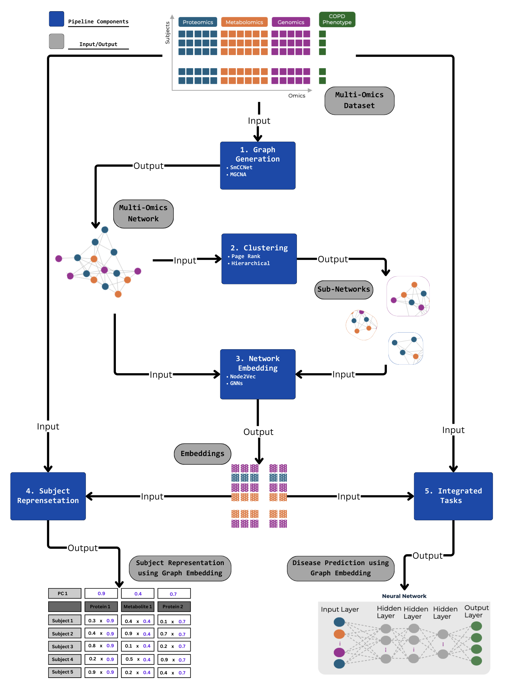
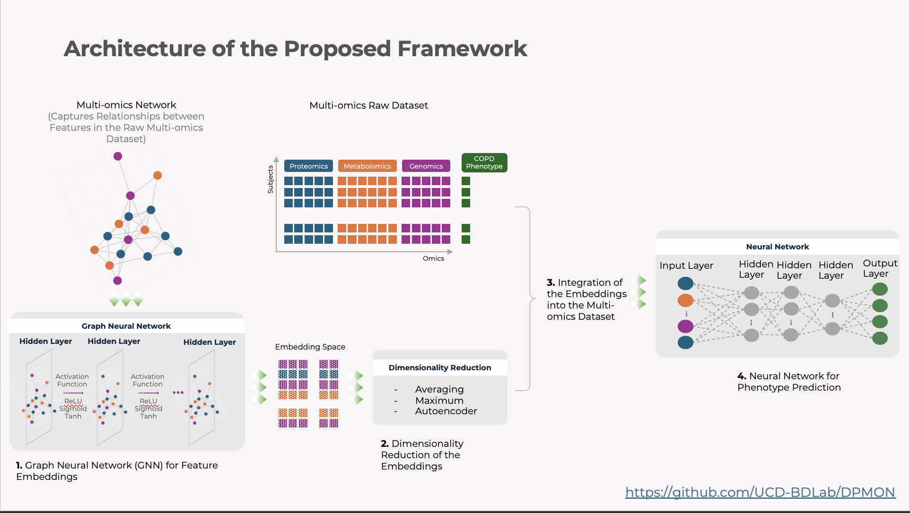

.. BioNeuralNet documentation master file

Welcome to BioNeuralNet
=======================

BioNeuralNet is a Python-based software tool designed to streamline the transformation of multi-omics 
data into network-based representations and lower-dimensional embeddings, enabling advanced analytical 
processes like clustering, feature selection, disease prediction, and environmental exposure assessment.

The framework combines state-of-the-art methods into a unified toolkit, offering:

- **Graph Construction**: Build robust multi-omics networks using WGCNA, SmCCNet, or existing networks.
- **Graph Clustering**: Identify modules and communities related to phenotypes or diseases.
- **Graph Embedding**: Generate embeddings (GNNs, Node2Vec) to simplify high-dimensional data.
- **Subject Representation**: Enrich subject-level omics data with network-derived embeddings.
- **Disease Prediction**: Integrate embeddings into predictive models (e.g., DPMON) for improved biomarker discovery and patient stratification.

   
   Overview of the BioNeuralNet workflow, integrating graph construction, embedding, and downstream tasks.

For advanced subject representations using embeddings:

.. figure:: _static/SubjectRepresentation1.png
   :align: center
   :alt: Subject Representation Workflow
   :figwidth: 80%

   Subject-level embeddings provide richer phenotypic and clinical context.

And for disease prediction tasks leveraging embeddings:

   Embedding-enhanced subject data support models like DPMON for improved disease prediction.

.. toctree::
   :maxdepth: 2
   :caption: Contents:

   installation
   usage
   tutorials
   api_reference
   _autosummary/index

Indices and tables
=================

* :ref:`genindex`
* :ref:`modindex`
* :ref:`search`
