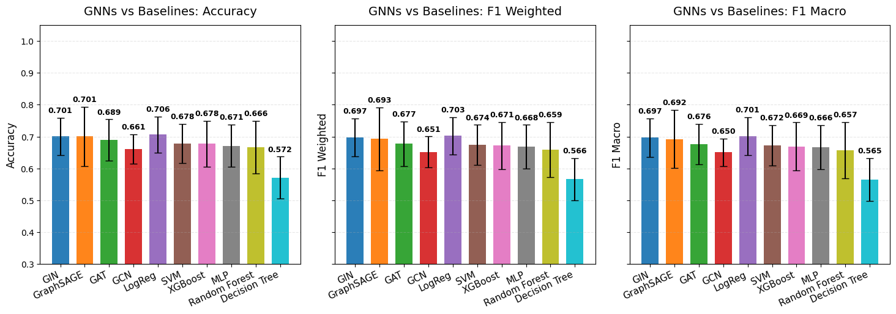

Metrics and Visualization
=========================

The ``metrics`` module provides a suite of tools for statistical analysis, quality control, and visualization. These functions allow users to assess data variance, explore network structures, evaluate clustering concordance, and visualize downstream performance metrics.

To see the full code used to generate the plots below (specifically for the Kidney Cancer analysis), refer to our **TCGA KIPAN Biomarker Discovery** tutorial in :doc:`notebooks/index`.

.. contents:: Table of Contents
   :local:
   :depth: 2

Performance Evaluation
----------------------

BioNeuralNet provides specialized plotting functions to compare model performance (e.g., Accuracy, F1-Score) across different experiments.

* :func:`bioneuralnet.metrics.plot_multiple_metrics`: Visualizes multiple metrics on the same figure for comprehensive benchmarking.
* :func:`bioneuralnet.metrics.plot_performance`: Plots a standard performance comparison.
* :func:`bioneuralnet.metrics.plot_performance_three`: Compares three distinct metric sets side-by-side.

**Example: Benchmarking GNNs vs Baselines**

The following plots demonstrate a comprehensive benchmarking analysis from our **TCGA KIPAN** case study, comparing BioNeuralNet GNN architectures (GIN, GraphSAGE, GAT, GCN) against standard baseline models across six different performance metrics.

.. image:: _static/metrics_plot_2.png
   :align: center
   :alt: GNNs vs Baselines: Recall, AUC, and AUPR

For implementation details and parameters, refer to the API documentation: :func:`bioneuralnet.metrics.plot_multiple_metrics`.

Embedding Visualization
-----------------------

:func:`bioneuralnet.metrics.plot_embeddings` visualizes high-dimensional embeddings (e.g., from GCN or GAT models) by projecting them into a 2-dimensional space using t-SNE or UMAP.

The example below shows embeddings from the **TCGA KIPAN** dataset, revealing distinct clusters corresponding to different omics modalities (DNA Methylation, RNA, miRNA).

.. image:: _static/emb_kipan.png
   :align: center
   :alt: 2D Projection of Embeddings from KIPAN Analysis

.. code-block:: python

   from bioneuralnet.metrics import plot_embeddings

   # Retrieve embeddings from the trained GNN model
   embeddings_array = embeddings.values  
   
   # Prepare labels (e.g., Omics Type or Phenotype) for coloring
   node_labels = gnn._prepare_node_labels()
   
   # Generate t-SNE projection
   plot_embeddings(embeddings_array, node_labels, title="Embeddings in 2D space")

Network Visualization & Clustering
----------------------------------

These functions allow you to inspect the topology of your constructed networks and the modules identified by clustering algorithms.

Network Graph
~~~~~~~~~~~~~

:func:`bioneuralnet.metrics.plot_network` displays the network graph from an adjacency matrix. It allows for filtering edges by weight to focus on strong connections (hubs).

.. image:: _static/kipan_net.png
   :align: center
   :alt: Network Visualization of Hub Genes in KIPAN
   :width: 80%

.. code-block:: python

   from bioneuralnet.metrics import plot_network, louvain_to_adjacency

   # Convert identified clusters (e.g., from Hybrid Louvain) to adjacency
   louvain_adj = louvain_to_adjacency(cluster_result)

   # Visualize the top connected module, filtering weak edges
   plot_network(
       louvain_adj, 
       weight_threshold=0.7, 
       show_labels=True, 
       show_edge_weights=True
   )

Cluster Comparison
~~~~~~~~~~~~~~~~~~

:func:`bioneuralnet.metrics.compare_clusters` allows for the visual and statistical comparison of different clustering results (e.g., comparing Hybrid Louvain results against SmCCNet results).

.. code-block:: python

   from bioneuralnet.metrics import compare_clusters

   # Compare Hybrid Louvain results with SmCCNet clusters
   compare_clusters(hybrid_result, smccnet_clusters, phenotype, merged_omics)

Correlation & Data Quality
--------------------------

These utilities help validate input data quality and quantify relationships between features and phenotypes.

Feature & Cluster Correlation
~~~~~~~~~~~~~~~~~~~~~~~~~~~~~

* :func:`bioneuralnet.metrics.omics_correlation`: Computes correlation between raw omics features.
* :func:`bioneuralnet.metrics.cluster_correlation`: Computes the Pearson correlation for a specific cluster of features against a phenotype.

.. code-block:: python

   from bioneuralnet.metrics import cluster_correlation

   # Calculate correlation of a specific cluster with the phenotype
   score = cluster_correlation(cluster_features, phenotype_data)

Data Variance
~~~~~~~~~~~~~

BioNeuralNet includes tools to inspect the variance within your omics datasets, which is crucial for feature selection.

* :func:`bioneuralnet.metrics.plot_variance_distribution`: Plots the distribution of variances across all features.
* :func:`bioneuralnet.metrics.plot_variance_by_feature`: Visualizes variance for individual features, helping to identify low-information features.

.. code-block:: python

   from bioneuralnet.metrics import plot_variance_distribution, plot_variance_by_feature

   # Visualize the distribution of variance in the dataset
   plot_variance_distribution(omics_df)

   # Inspect specific feature variances to guide filtering
   plot_variance_by_feature(omics_df, top_n=20)

Utilities
---------

* :func:`bioneuralnet.metrics.louvain_to_adjacency`: A helper function that converts the output of Louvain clustering algorithms into an adjacency matrix format suitable for plotting with ``plot_network``.

Reference
---------

For more details on each function and its parameters, see the full API reference: 
.. `bioneuralnet.metrics API <https://bioneuralnet.readthedocs.io/en/latest/_autosummary/bioneuralnet.metrics.html>`_