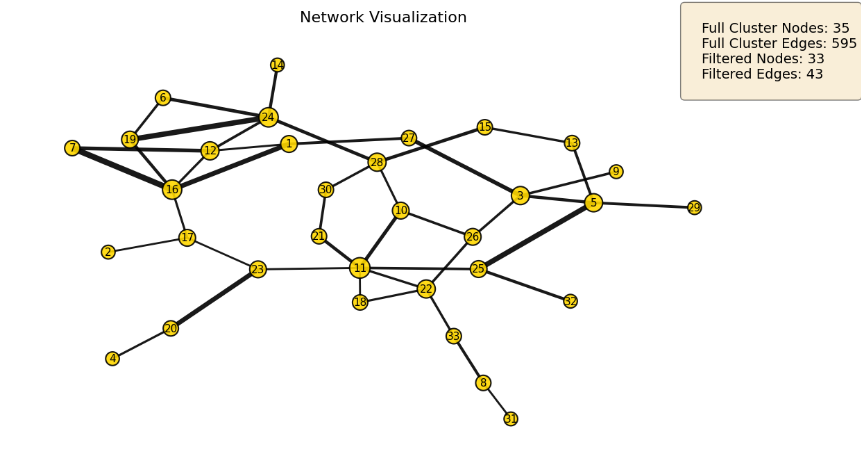
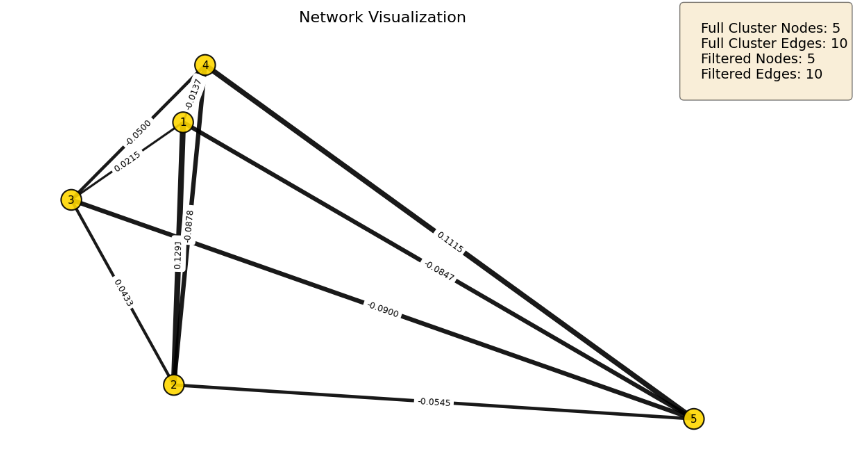
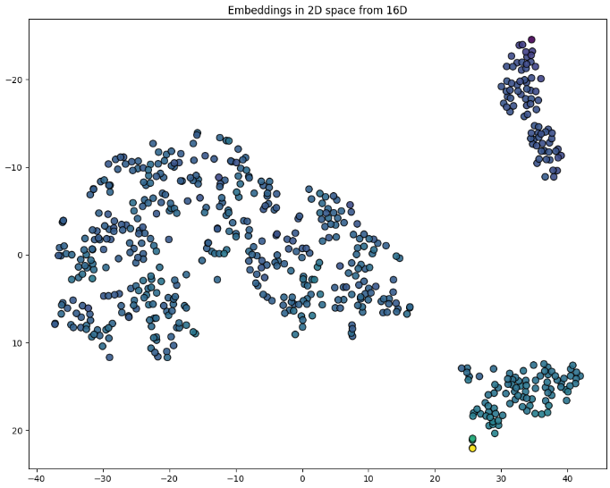
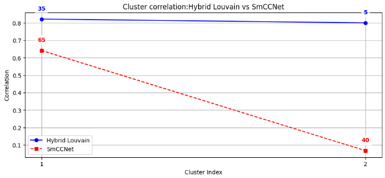
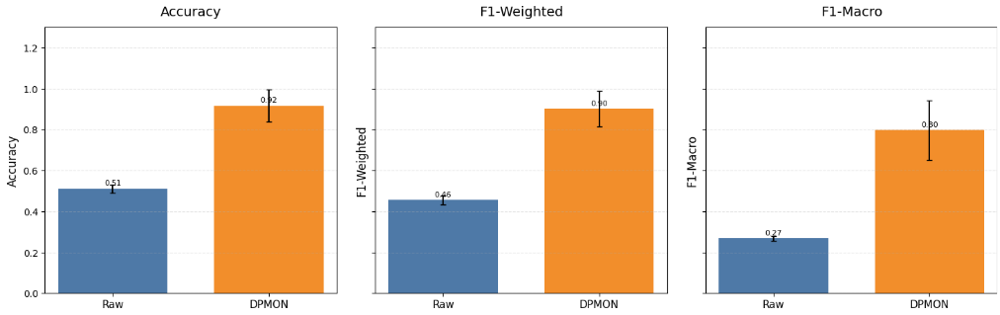

Metrics
=======

The metrics module includes functions that perform statistical analyses and generate visualizations. Functions from the metrics module allow users to assess and explore network-based embeddings, evaluate clustering performance, and explore the tabular data and network structure.
The following examples and plots are from our :doc:`Quick_Start`.

Visualization
-------------

The module also contains several plotting functions:

- :func:`bioneuralnet.metrics.plot.plot_network` displays the network graph from an adjacency matrix.
- :func:`bioneuralnet.metrics.plot.plot_embeddings` visualizes high-dimensional embeddings by projecting them into a 2 dimensional space.

Example Usage
-------------

**Network Visualization**
Visualization of network showing labels but no edge weights.

**Table Output:**

+-------+-----------+--------+
| Index |   Omic    | Degree |
+=======+===========+========+
|  11   | Gene_411  |   6    |
+-------+-----------+--------+
|  16   | Gene_7    |   5    |
+-------+-----------+--------+
|  24   | Gene_174  |   5    |
+-------+-----------+--------+
|   3   | Gene_1    |   4    |
+-------+-----------+--------+
|  28   | Gene_114  |   4    |
+-------+-----------+--------+

Visualization of network showing labels and edge weights.

**Table Output:**

+--------+-----------+--------+
| Index  |   Omic    | Degree |
+========+===========+========+
|   1    | Gene_7    |   4    |
+--------+-----------+--------+
|   2    | Gene_6    |   4    |
+--------+-----------+--------+
|   3    | Gene_1    |   4    |
+--------+-----------+--------+
|   4    | Gene_446  |   4    |
+--------+-----------+--------+
|   5    | Gene_53   |   4    |
+--------+-----------+--------+

.. code-block:: python

   from bioneuralnet.metrics import plot_network
   from bioneuralnet.metrics import louvain_to_adjacency

   cluster1 = hybrid_result[0]
   cluster2 = hybrid_result[1]

   # Convert Louvain clusters into adjacency matrices
   louvain_adj1 = louvain_to_adjacency(cluster1)
   louvain_adj2 = louvain_to_adjacency(cluster2)

   # Plot using the converted adjacency matrices
   cluster1_mapping = plot_network(louvain_adj1, weight_threshold=0.1, show_labels=True, show_edge_weights=False)
   print(cluster1_mapping.head())
   cluster2_mapping = plot_network(louvain_adj2, weight_threshold=0.01, show_labels=True, show_edge_weights=True)
   print(cluster2_mapping.head())

**Embeddings Visualization**

Visualizing a 16 dimension embedding space projected into a 2 dimensional space.

.. code-block:: python

   from bioneuralnet.metrics import plot_embeddings

   # Using our embeddings instance, we get the necessary labels for the graph.
   node_labels = gnn._prepare_node_labels()
   embeddings_array = embeddings.values  
   embeddings_plot = plot_embeddings(embeddings_array, node_labels)

Correlation Metrics
-------------------

- :func:`bioneuralnet.metrics.correlation.cluster_correlation` computes the Pearson correlation for a cluster of features with a phenotype. Clusters with fewer than two features or with zero variance are handled properly.

**Cluster Comparison**
Hybrid louvain with the SmCCNet clusters.

.. code-block:: python

   # Lets compare hytbrid louvain with the SmCCNet clusters
   print("Number of clusters:", len(hybrid_result))

   compare_clusters(hybrid_result, clusters, phenotype, merged_omics)

Evaluation
----------

- :func:`bioneuralnet.metrics.evaluation.evaluate_rf` trains and evaluates a Random Forest model over multiple runs.
- :func:`bioneuralnet.metrics.plot.plot_multiple_metrics` plots multiple metrics on the same figure.

**Plotting Multiple Performance Metrics**
Visualizing performance metrics comparison.

.. code-block:: python

   from bioneuralnet.metrics import evaluate_rf, plot_multiple_metrics

   # raw omics evaluation
   X_raw = merged_omics.values
   y_global = phenotype.values
   rf_acc, rd_f1w, rf_f1m = evaluate_rf(X_raw, y_global, n_estimators=100, runs=5, mode="classification")

   # metrics dictionary
   metrics = {
      "Accuracy": {"Raw": rf_acc,"DPMON": dpmon_acc_tuple},
      "F1-Weighted": {"Raw": rd_f1w,"DPMON": dpmon_f1w_tuple},
      "F1-Macro": {"Raw": rf_f1m,"DPMON": dpmon_f1m_tuple}
   }

   plot_multiple_metrics(metrics)

Further Information
-------------------

For more details on each function and its parameters, see the metrics reference: https://bioneuralnet.readthedocs.io/en/latest/_autosummary/bioneuralnet.metrics.html
