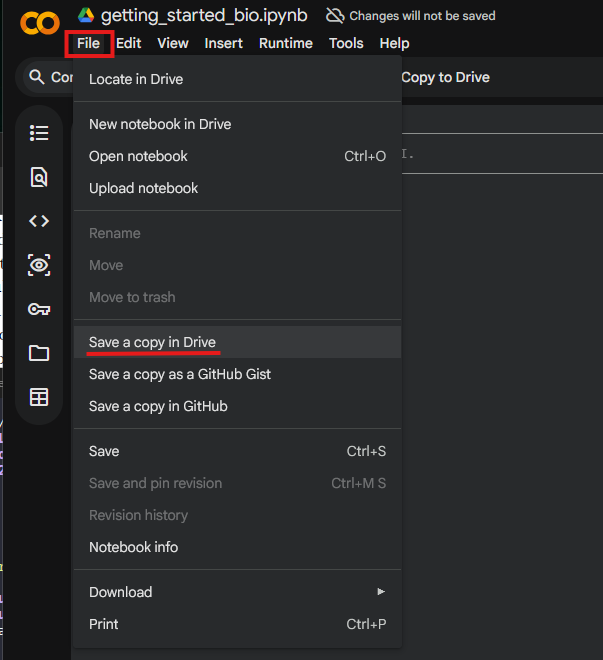
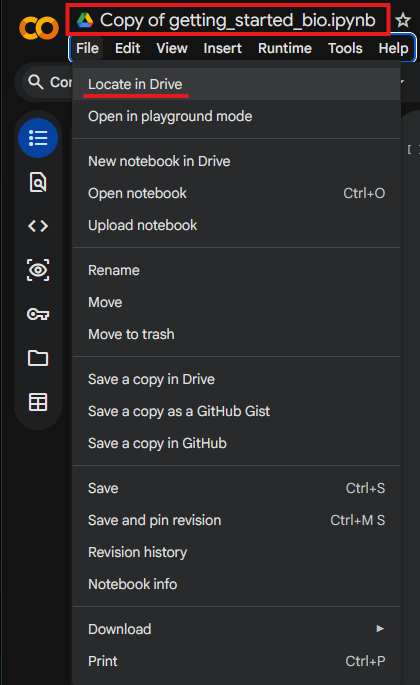
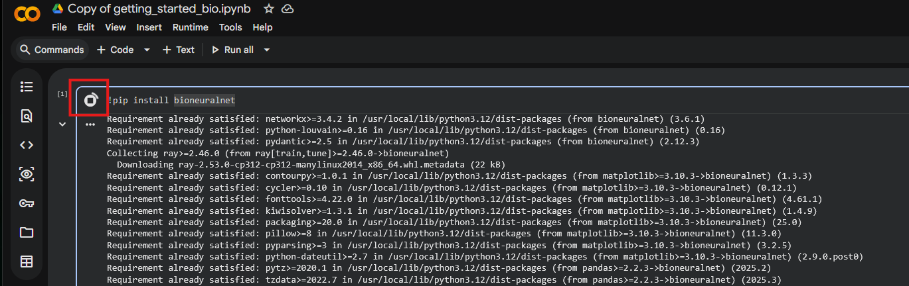
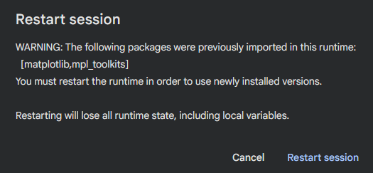
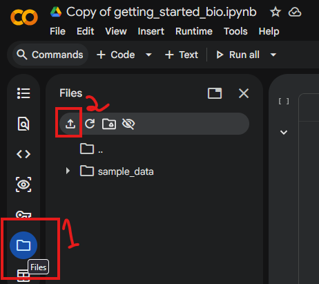
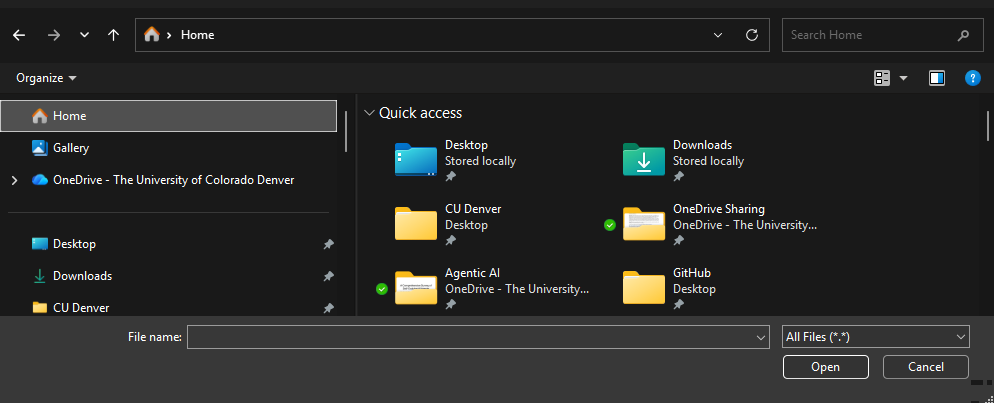
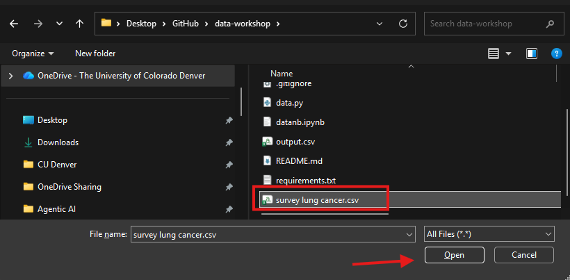
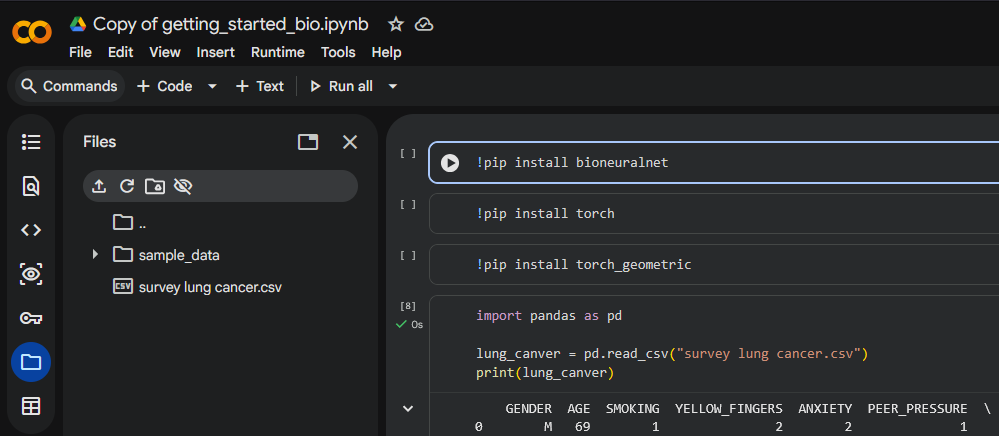
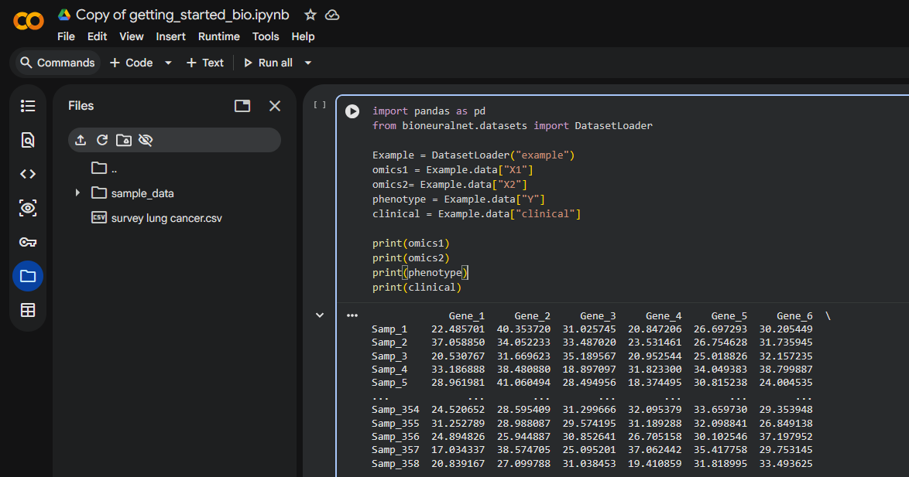
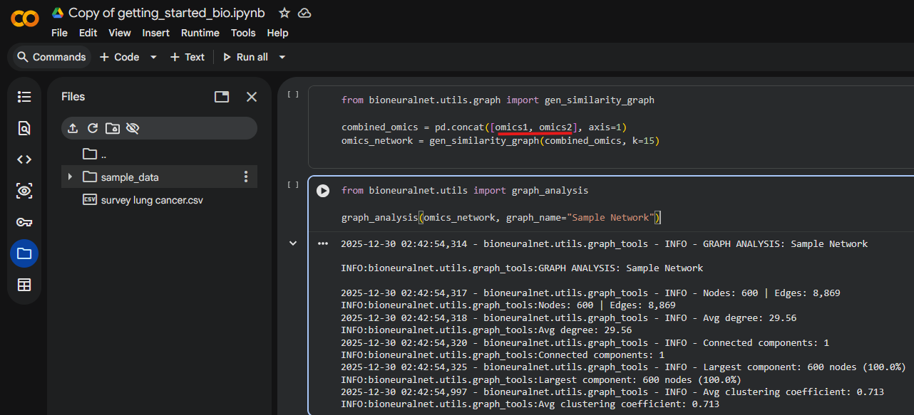

Quick Start for Biologists
==========================

We will be using Google Colab, a Google Cloud development environment. The only prerequisite is to have a free Google account.

**Step 1: Open the Notebook**

Open the following link which will take you to a Google Colab space. You may be prompted to sign into your Google account if not already signed in.

`Launch BioNeuralNet Notebook <https://colab.research.google.com/drive/1uCM7ZcVbp9tr6M4CKgg4CZrbboFJeOSV?usp=sharing>`_

**Step 2: Save Your Own Copy**

To run and edit the code, you must save a copy to your personal Drive. Go to **File > Save a copy in Drive**.

   *Save a copy to your Google Drive to enable editing.*

   *You will now be working on your own "Copy of..." the notebook.*

**Step 3: Install the Library**

Run the first code cell to install the ``bioneuralnet`` package by clicking the **Play** button.

   *Click the Play button to install dependencies.*

**Step 3.5: Install the PyTorch and PyTorch Geometric**

Run the following two cells to also install ``torch`` and ``torch_geometric``.

**Important:** You may need to restart the session to use the newly installed packages. Click **Restart session** when the warning appears.

   *Restart the runtime to finalize installation.*

**Step 4: Upload Your Data**

1. Click the **Files** icon (folder) on the left sidebar.
2. Click the **Upload** icon.

   *Open the file manager and select Upload.*

Navigate to your data file (e.g., ``survey lung cancer.csv``) on your computer and select **Open**.

   *Locate your dataset folder.*

   *Select your CSV file to upload.*

Once uploaded, you will see your file in the side panel. You can now load it using pandas as shown in the notebook.

   *Verify that your file appears in the sidebar.*

**Step 5: Run Example Analysis**

You can now use the built-in ``DatasetLoader`` to load example data to see how to use BioNeuralNet.

   *Loading and inspecting the data.*

Finally, use ``gen_similarity_graph`` to create a network and ``graph_analysis`` to view the statistics.

To generate a network using your own data you will need to change variables ``omics1`` and ``omics2`` with your uploaded csv file (e.g., the ``lung_cancer`` variable we showed at the end of Step 4).

   *Generating the network and viewing graph statistics.*