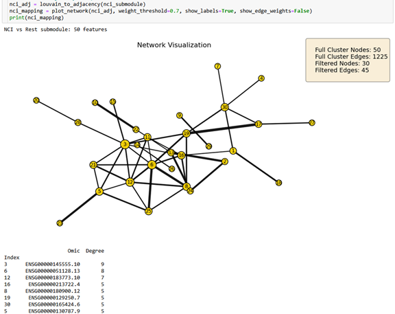
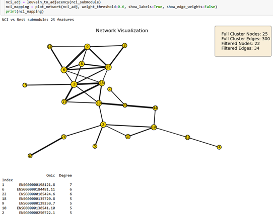

Subgraph Detection & Biomarkers
===============================

BioNeuralNet supports **phenotype-aware subgraph detection**, enabling users to extract small, interpretable modules of omics features that are tightly linked to clinical labels. These methods go beyond purely structural clustering by explicitly incorporating feature-phenotype correlations, making them well-suited for biomarker discovery.

For a step-by-step example on the TCGA-KIPAN cohort, see
:doc:`TCGA-KIPAN <notebooks/TCGA-KIPAN>`.

Method Overview
---------------

BioNeuralNet implements three complementary, phenotype-aware network methods:

- **Correlated PageRank**:
  Ranks nodes using a PageRank-like iteration with a **phenotype-informed personalization vector**. Features that are both central and highly correlated with the phenotype receive higher scores.

  .. math::

     \mathbf{r} \;=\; \alpha\,\mathbf{M}\,\mathbf{r} + (1 - \alpha)\,\mathbf{p}

  - :math:`\mathbf{M}`: normalized adjacency (transition probability matrix).
  - :math:`\mathbf{p}`: personalization vector built from feature-phenotype correlations.

- **Correlated Louvain**:
  Modifies Louvain community detection to balance **structural modularity** and **phenotype enrichment**, optimizing

  .. math::

     Q^* \;=\; k_L\,Q \;+\; (1 - k_L)\,\overline{\lvert \rho \rvert}

  - :math:`Q`: Newman-Girvan modularity.
  - :math:`\overline{\lvert \rho \rvert}`: mean absolute Pearson correlation between cluster features and the phenotype.
  - :math:`k_L`: user-defined trade-off between structure and phenotype relevance.

- **Hybrid Louvain**:
  Iteratively combines Correlated Louvain (for initial modules) with Correlated PageRank (to refine and expand phenotype-enriched clusters), yielding compact driver modules suitable for biomarker interpretation.

Graph Construction in Case Studies
----------------------------------

In the KIPAN and ROSMAP examples, the networks used for subgraph detection were constructed as follows:

- Start from the **ANOVA-Random Forest intersection** for each omics type.
- Apply a variance filter to retain the most variable features:
  - Selected methylation features: **300** (reduced from 771)
  - Selected RNA features: **300** (reduced from 2054)
  - Selected miRNA features: **300** (reduced from 310)
- Concatenate the three omics blocks, yielding **900 features** for graph
  construction (matrix of shape :math:`900 \times 900`).
- Build a **similarity network** using a :math:`k`-nearest-neighbor graph with
  :math:`k = 10`, and then apply the correlated clustering methods above.

Case Study 1: TCGA-KIPAN KICH-Associated Module
-----------------------------------------------

As an example, we applied **Hybrid Louvain** to the TCGA-KIPAN multi-omics network using a KICH-versus-rest label. One resulting driver module is a KICH-associated cluster of omics features most strongly linked to the KICH label.

.. figure:: _static/kipan_net.png
   :align: center
   :alt: KICH-associated Hybrid Louvain module

   Figure S2b. KICH-associated driver module from Hybrid Louvain. The full module contains 69 omics features; the visualization displays only the strongest associations (Pearson correlation threshold :math:`r \geq 0.76` in the original data), yielding 27 filtered nodes and 62 strong edges.

Within the filtered subgraph, a small set of hub features dominate the local connectivity pattern (e.g., INPP5J, SLC26A7, HEPACAM2, CLNK, DMRT2), forming a compact KICH-associated module. This pattern is consistent with a Chromophobe RCC origin in intercalated cells and highlights a small set of candidate biomarkers and regulators for further validation.

- **SLC26A7** (KICH marker): Schrader et al., *Urol Oncol*, 2016.
- **DMRT2** (lineage regulator): Picard et al., *PNAS*, 2025.
- **INPP5J** (pathway regulator): annotated in *The Human Protein Atlas (HPA)*.

Case Study 2: ROSMAP NCI-versus-Rest Submodules
-----------------------------------------------

We also applied Hybrid Louvain to a similarity network built from ROSMAP multi-omics data, using an **NCI-versus-rest** clinical label (NCI = a non-impaired cognitive status category in the original study). Because ROSMAP is a protected dataset, we only report graph-level summaries and omit detailed clinical or feature annotations.

Two nested submodules were examined:

- A **50-feature submodule** (stronger connectivity)
- A **25-feature core submodule** (more stringent pruning)

First ROSMAP Submodule (50 Features)
------------------------------------

   Cluster 1. ROSMAP NCI-versus-rest submodule with 50 features. The full submodule contains 50 nodes and 1,225 edges (average degree 49.0). After applying an edge-weight threshold (:math:`r \geq 0.7`), 30 nodes and 45 edges remain, forming a single connected component with an average clustering coefficient of 0.347.

Second ROSMAP Submodule (25 Features)
-------------------------------------

   Cluster 2. Core ROSMAP NCI-versus-rest submodule with 25 features. The full submodule contains 25 nodes and 300 edges (average degree 24.0). After thresholding (:math:`r \geq 0.6`), 22 nodes and 34 edges remain, again forming a single connected component with an average clustering coefficient of 0.393.

Together, these ROSMAP subgraphs demonstrate that the same Hybrid Louvain pipeline used in KIPAN generalizes to an independent cohort, yielding compact, phenotype-associated modules even when only graph-level summaries can be shared.

AD Knowledge Portal. Available from: https://adknowledgeportal.org/. Data generated from postmortem brain tissue provided by the Religious Orders Study and Rush Memory and Aging Project (ROSMAP) cohort at Rush Alzheimer's Disease Center, Rush University Medical Center, Chicago. Supported by Cure Alzheimer’s Fund and NIH grants AG058002, AG062377, NS110453, NS115064, AG062335, AG074003, NS127187, MH119509, HG008155, RF1AG062377, RF1AG054321, R01AG054012, and GM087237.
