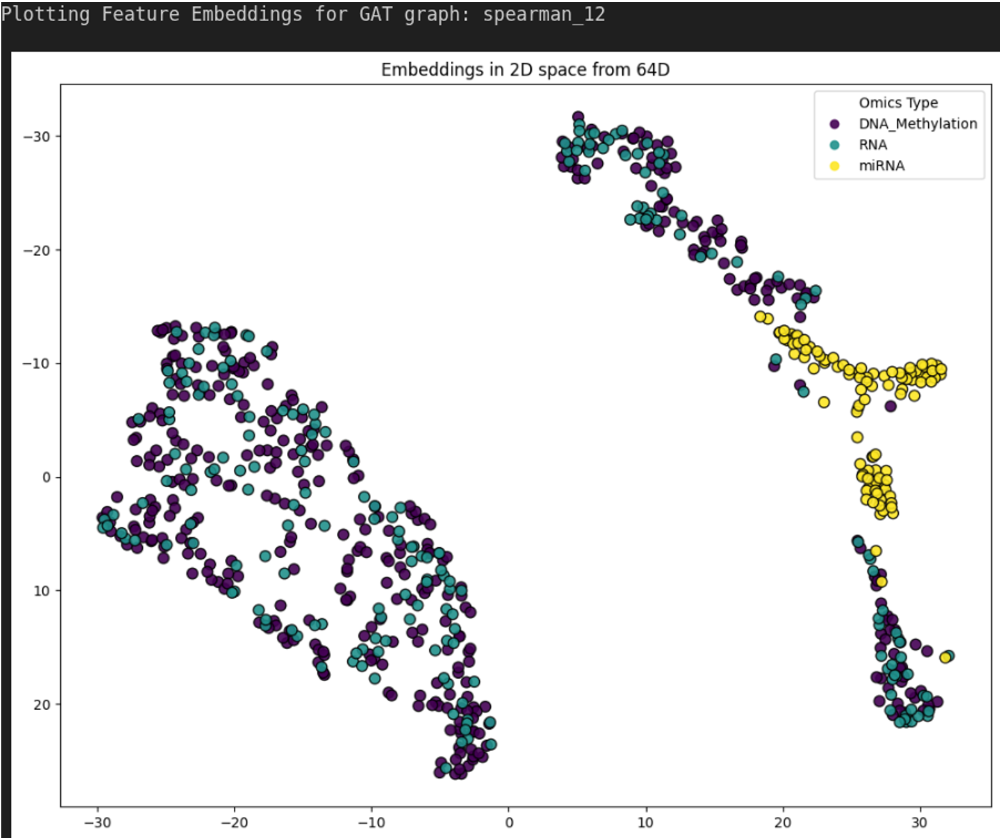
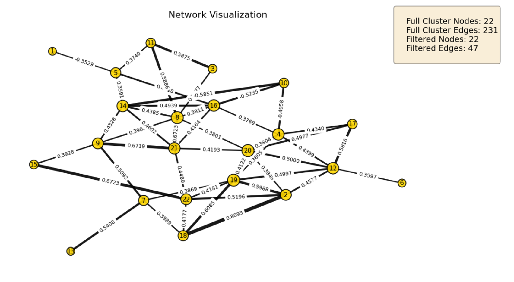
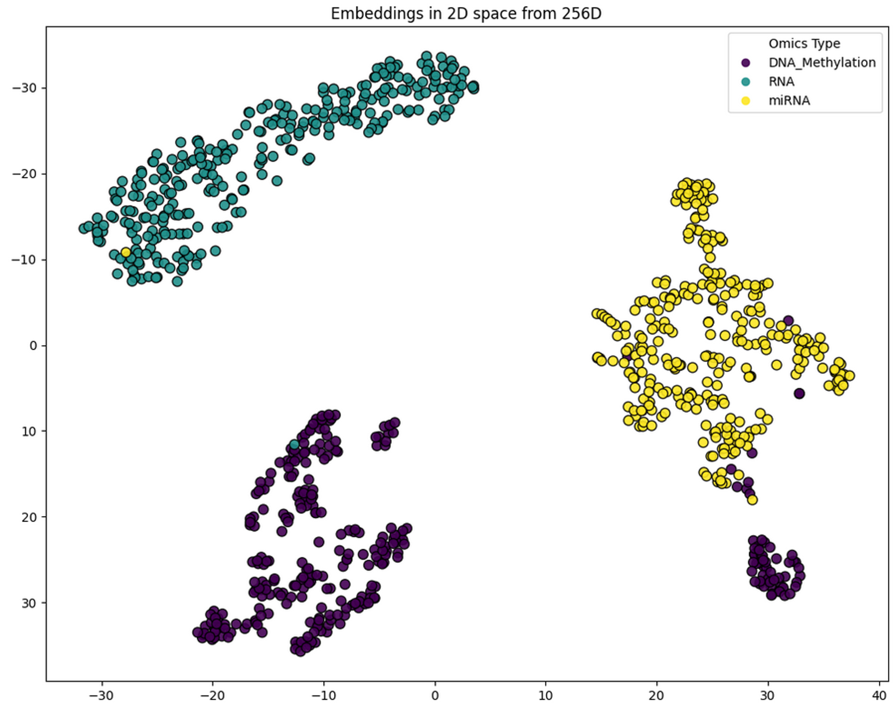
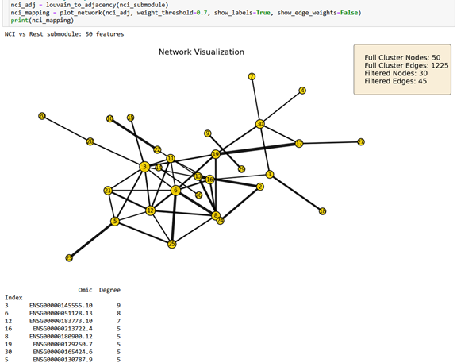
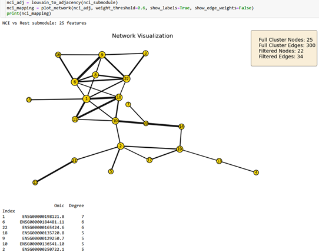
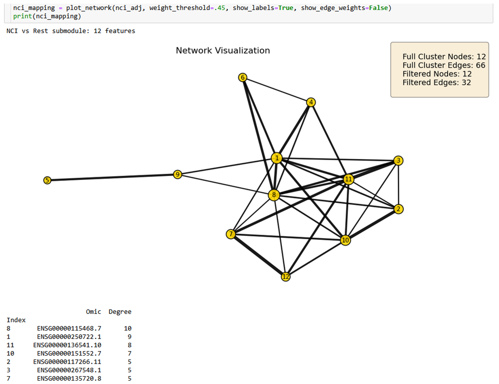
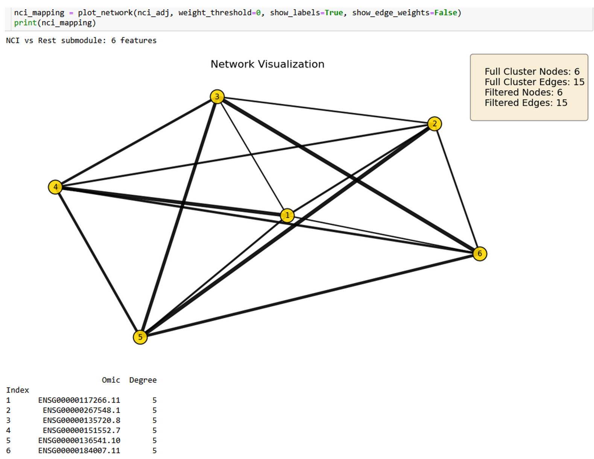

Subgraph Detection & Biomarkers
===============================

BioNeuralNet supports **phenotype-aware subgraph detection**, enabling users to extract small, interpretable modules of omics features that are tightly linked to clinical labels. These methods go beyond purely structural clustering by explicitly incorporating feature-phenotype correlations, making them well-suited for biomarker discovery.

For a step-by-step example on the TCGA-LGG cohort, see
:doc:`TCGA-LGG <notebooks/TCGA-LGG>`.

Method Overview
---------------

BioNeuralNet implements three complementary, phenotype-aware clustering classes:

**Louvain**

Standard Louvain community detection via alternating local optimization (Phase 1) and graph aggregation (Phase 2). Phase 1 evaluates moving each node to neighbor communities and applies the move yielding the highest positive modularity gain:

.. math::

   \Delta Q = \frac{k_{v,in}}{m} - \frac{\Sigma_{tot} \cdot k_v}{2m^2}

Phase 2 compresses the graph into super-nodes, summing edge weights across communities, and repeats until convergence.

**CorrelatedLouvain**

Extends Louvain by replacing the standard modularity gain with a hybrid objective that balances structural modularity and absolute phenotype correlation:

.. math::

   Q_{hybrid} = k_L\,Q + (1 - k_L)\,\rho

When evaluating the movement of node :math:`v` from community :math:`D` to community :math:`C`, the gain is:

.. math::

   \Delta_{hybrid} = k_L\,\Delta Q + (1 - k_L)\,\Delta\rho

where the correlation gain :math:`\Delta\rho` is:

.. math::

   \Delta\rho = [|\rho(D \setminus \{v\})| + |\rho(C \cup \{v\})|] - [|\rho(D)| + |\rho(C)|]

:math:`\rho` is computed as the absolute Pearson correlation between the first principal component (PC1) of the community's omics submatrix and the phenotype vector :math:`Y`. PC1 correlations are cached per community for efficiency.

``k_L`` controls the trade-off between modularity and phenotype correlation.

**CorrelatedPageRank**

Implements personalized PageRank with a phenotype-aware sweep cut. The PageRank stationary distribution is:

.. math::

   \mathbf{pr}_\alpha(s) = \alpha\,s + (1 - \alpha)\,\mathbf{pr}_\alpha(s)\,W

where :math:`\alpha` is the teleportation probability, :math:`s` is the personalization vector, and :math:`W` is the transition matrix.

.. note::

   The ``networkx.pagerank`` implementation uses ``alpha`` as the damping factor (link-following probability). Internally, ``nx_alpha = 1 - teleport_prob``.

Seed node teleportation weights are set by each node's marginal contribution to correlation:

.. math::

   \alpha_i = \frac{\rho_i}{\max(\rho_{seeds})} \cdot \alpha_{max}, \quad \rho_i = |\rho(S)| - |\rho(S \setminus \{i\})|

The sweep cut sorts nodes by PageRank-per-degree in descending order and minimizes **Hybrid Conductance** over prefix sets :math:`S_i`:

.. math::

   \Phi_{hybrid} = k_P\,\Phi + (1 - k_P)\,\rho

where :math:`\Phi` is standard conductance and :math:`\rho` is the negative absolute Pearson correlation of the current set.

**HybridLouvain**

Iteratively alternates CorrelatedLouvain and CorrelatedPageRank to produce compact, phenotype-enriched subgraphs:

- **Iteration 1 (Global Scope)**: Run CorrelatedLouvain on the full graph. Select the community with the highest :math:`|\rho|`. Compute seed weights via marginal correlation contributions. Run CorrelatedPageRank on the full graph. Apply sweep cut to produce the initial refined subgraph.
- **Iteration 2+ (Local Scope)**: Restrict the graph to the output of the previous sweep cut. Run CorrelatedLouvain on this reduced subgraph. Repeat until size converges or a singleton is produced.

The subgraph with the highest :math:`|\rho|` across all iterations is returned as the best result.

Case Study 1: TCGA-LGG Survival-Associated Module
--------------------------------------------------

HybridLouvain was applied to the TCGA-LGG Spearman correlation network (k=12, 700 nodes) using binary vital status as the phenotype label (Alive vs. Deceased). Feature selection used Laplacian Score filtering (400 methylation, 200 mRNA, 100 miRNA). The pipeline iteratively pruned the network, identifying a 22-node subgraph at iteration 4 as the best result.

   Figure 1.1. 2D latent space visualization of DPMON feature embeddings on the TCGA-LGG Spearman network. t-SNE projection showing separation between omics modalities.

   Figure 1.2. Survival-associated driver module from HybridLouvain on TCGA-LGG (Spearman k=12), iteration 4 (22 nodes, conductance 0.388).

.. list-table:: Table 1.1. HybridLouvain subnetwork identification (TCGA-LGG)
   :header-rows: 1
   :widths: 20 25 25 30

   * - Iteration
     - Nodes Remaining
     - Correlation
     - Conductance
   * - 0
     - 402
     - 0.3061
     - 0.0004
   * - 1
     - 214
     - 0.3252
     - 0.1177
   * - 2
     - 93
     - 0.3305
     - 0.3262
   * - 3
     - 46
     - 0.3365
     - 0.3093
   * - **4**
     - **22**
     - **0.3363**
     - **0.3877**
   * - 5
     - 10
     - 0.3487
     - 0.4134
   * - 6
     - 5
     - 0.3568
     - 0.4013

.. list-table:: Table 1.2. Top hub features in LGG survival module (Iteration 4)
   :header-rows: 1
   :widths: 15 40 20 25

   * - Index
     - Omic Feature
     - Degree
     - Source
   * - 20
     - HIVEP3
     - 7
     - RNA
   * - 19
     - DBH
     - 7
     - RNA
   * - 8
     - ERMP1
     - 7
     - RNA
   * - 12
     - LFNG
     - 6
     - RNA
   * - 21
     - MIR23A
     - 6
     - miRNA
   * - 4
     - THADA
     - 6
     - RNA
   * - 16
     - JAKMIP3
     - 6
     - RNA
   * - 14
     - DLGAP4
     - 6
     - RNA
   * - 2
     - HRH2
     - 5
     - RNA
   * - 22
     - CLIC1
     - 5
     - RNA

Case Study 2: ROSMAP Alzheimer's Disease Biomarker Discovery
-------------------------------------------------------------

HybridLouvain was applied to a cosine similarity network (k=10, 900 nodes) built from ROSMAP multi-omics data (300 methylation, 300 mRNA, 300 miRNA after final Variance k=300 selection). The target label was NCI-versus-rest (No Cognitive Impairment vs. MCI + Dementia). GAT embeddings were generated for the full 900-node network to visualize omics modality separation in the latent space. Because ROSMAP is a protected dataset, only graph-level summaries are reported.

   Figure 2.1. Embedding space of the 900-node ROSMAP multi-omics network. GAT separation across omics types forming a biological hierarchy.

Application of HybridLouvain identified five distinct subnetworks. The subnetworks reveal distinct mechanisms of Alzheimer's pathology:

- **50-node subnetwork**: Highlights synaptic plasticity and cytoskeletal scaffolding (driven by MYO10 and HOMER3).
- **25-node subnetwork**: Captures white matter degeneration and cellular senescence (OLIG1, FOXO4).
- **12-node subnetwork**: Identifies a critical failure in metabolic cofactor recycling and aberrant cell cycle re-entry (QDPR, CDK18).
- **6-node subnetwork**: Points toward protein clearance and lysosomal dysfunction.

.. list-table:: Table 2.1. HybridLouvain subnetwork identification (ROSMAP)
   :header-rows: 1
   :widths: 25 35 40

   * - Iteration
     - Nodes Remaining
     - Correlation
   * - 0
     - 600
     - 0.0857
   * - 1
     - 50
     - 0.1563
   * - 2
     - 25
     - 0.1608
   * - 3
     - 12
     - 0.1554
   * - 4
     - 6
     - 0.1921

   Figure 2.2. 50-node NCI-versus-rest submodule filtered at edge-weight threshold r >= 0.7. Highlights synaptic plasticity and cytoskeletal scaffolding (MYO10, HOMER3).

   Figure 2.3. 25-node NCI-versus-rest subgraph filtered at r >= 0.6. Captures white matter degeneration and cellular senescence (OLIG1, FOXO4).

   Figure 2.4. 12-node NCI-versus-rest subgraph filtered at r >= 0.45. Identifies metabolic cofactor recycling failure and aberrant cell cycle re-entry (QDPR, CDK18).

   Figure 2.5. 6-node NCI-versus-rest subgraph at 0-weight threshold. Points toward protein clearance and lysosomal dysfunction.

Data from the Religious Orders Study and Rush Memory and Aging Project (ROSMAP) cohort at Rush Alzheimer's Disease Center, Rush University Medical Center, Chicago. Available via the `AD Knowledge Portal <https://adknowledgeportal.org/>`_. Supported by Cure Alzheimer's Fund and NIH grants AG058002, AG062377, NS110453, NS115064, AG062335, AG074003, NS127187, MH119509, HG008155, RF1AG062377, RF1AG054321, R01AG054012, and GM087237.